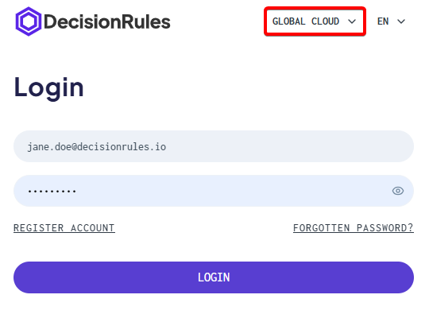

# Cloud

In the Cloud environment, the application is hosted and managed by us. User accounts, authentication, and subscriptions are handled centrally as part of the Cloud service.

Users can create an account using email and password credentials or by signing in through a supported identity provider, such as Google or Microsoft. After registration, a verification email is sent to confirm the email address before the account can be used.

Once registered, users can sign in directly through the login page. Depending on the subscription and configuration, additional authentication options such as Single Sign-On (SSO) may also be available.

User management, including inviting additional users, is performed within the application after signing in.

The following pages describe individual access flows available in the Cloud environment, including registration, login, and SSO authentication.

### **How can I tell I am using Decision Rules Cloud?**

You are using the Cloud version of DecisionRules if you access the application through the official public DecisionRules URL and did not install the application yourself.

When signing up or logging in, you can select the target region at the top of the registration or login form. The selected region determines where your Decision Rules environment will be created and accessed.

<figure><figcaption></figcaption></figure>

In the Cloud environment, registration and authentication are managed directly by DecisionRules. This typically includes built-in registration, email verification, and managed sign-in options.

If you are unsure whether you are using the Cloud version, check the application URL or contact your administrator.


[sign-up-and-login-on-cloud.md](sign-up-and-login-on-cloud.md)



[single-sign-on-sso.md](single-sign-on-sso.md)



[invitations-and-permissions-on-cloud.md](invitations-and-permissions-on-cloud.md)

