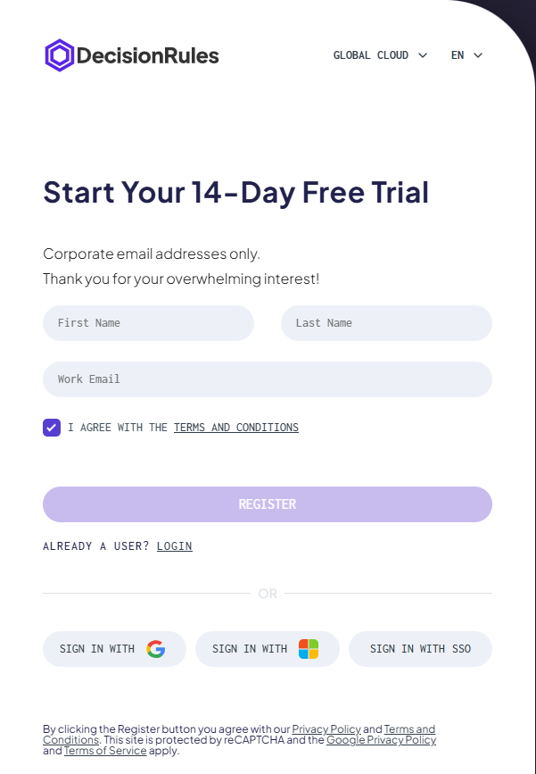
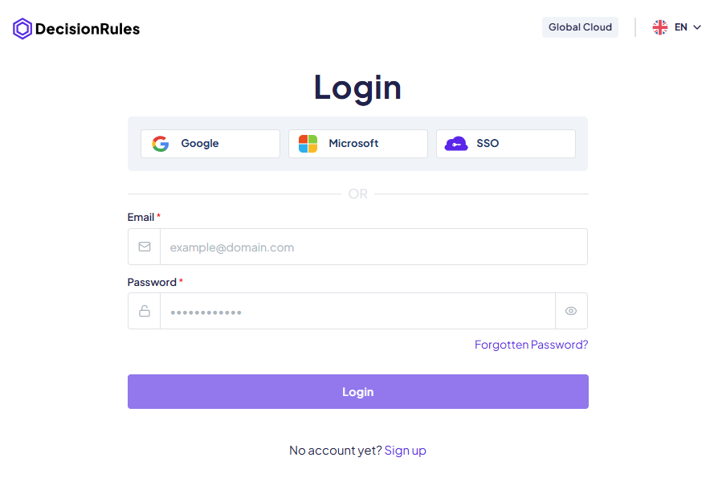

# Sign Up & Login on Cloud

To start using DecisionRules, you’ll first need to create an account. Signing up is simple and flexible. You can use your email, a Microsoft or Google account, or log in through [your organization with SSO](../../organization/settings.md#single-sign-on-sso). Just choose the option that suits you best, and you’ll be up and running in no time.

<figure><figcaption>
Sign Up Page
</figcaption></figure>

## Sign Up – Creating a New Account

Users can register using one of three sign-up methods: **email and password**, **Microsoft or Google account**, or **Single Sign-On (SSO)**. Each method has a slightly different flow.

### **Sign Up with Credentials**

When choosing the **Email & Password** option, you are prompted to fill out a short registration form. After submitting the form, a confirmation screen appears, letting you know that a verification email has been sent to your provided address.

To complete the registration:

1. Open inbox and click the verification link.
2. You are redirected to a secure page to **set their account password**.
3. Once the password is set, you are logged in and redirected into the app.

### **Sign Up with Microsoft or Google**

When signing up via a **provider**, a pop-up window appears for you to authenticate with your Microsoft or Google account.

After successful authentication:

1. You are redirected to a short onboarding screen.
2. This screen asks for a few additional details to complete your profile.
3. After submitting the form, you are taken directly into the app.

### **Sign Up with SSO**

Users from organizations with **Single Sign-On (SSO)** configured can register using their company credentials.


For more information about SSO see dedicated page [here](single-sign-on-sso/).


## Login – Accessing Your Account

Existing users can log in using the same methods they registered with:

* **Email & Password** – Enter the credentials you set during registration.
* **Microsoft or Google** – Use your linked provider account to log in.
* **SSO** – Choose your organization’s SSO option and follow the redirect.

Once authenticated, you’ll be taken straight to your workspace.

<figure><figcaption>
Login Page
</figcaption></figure>
