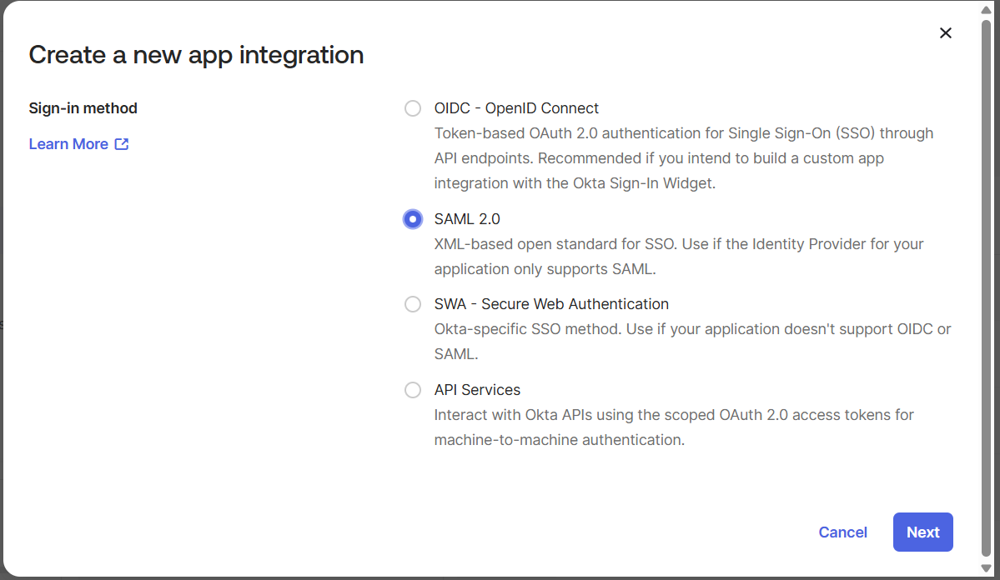
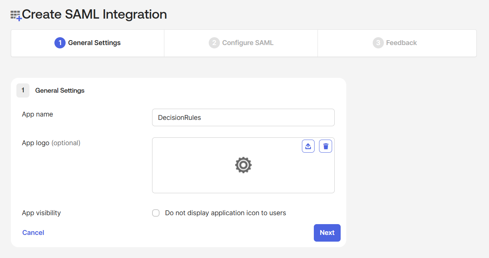
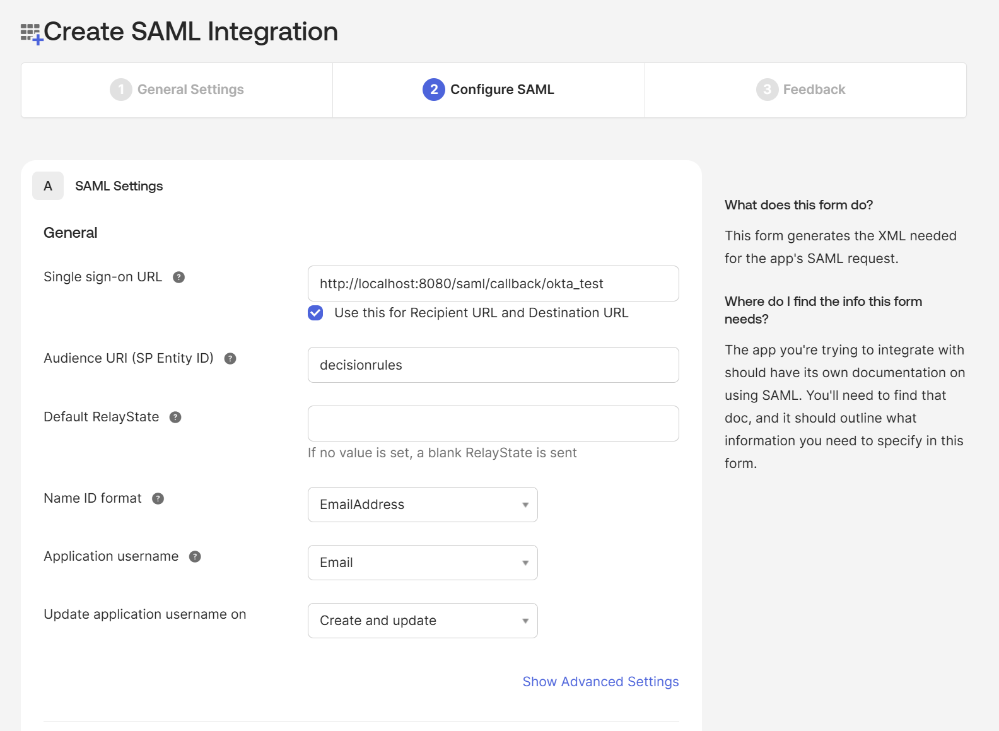

# Set up Okta SSO

## **Create Application**


We will mostly focus on the minumum required settings&#x20;


In the Okta Admin Console navigate to **Applications** -> **Applications**  -> **Create App Integration**.&#x20;

From the methods, select **SAML**.

<figure><figcaption></figcaption></figure>

### Step 1

In the first step, you have to set up app name

<figure><figcaption>
Step 1
</figcaption></figure>

### Step 2

In the second step you have to fill in Single sign-on URL. It is&#x20;

* For the **Single sing-on URL** put the address of your server (API) container with "/saml/callback/{sso\_name}" following.&#x20;
  * example: "_https://api.sandbox.decisionrules.io/saml/callback/okta\_test"_
* For the **Audience URI** you can put in any easily identifiable name.

<figure><figcaption>
Step 2
</figcaption></figure>

After creating the configuration, you can download the **certificate** at the Sign on tab. There is also **Sign On Url**.

### Decision Rules SSO setup


[Here](./#how-do-i-set-up-a-single-sign-on-access-for-my-organization) you can find more info how set up SSO in DR application.


<figure><figcaption></figcaption></figure>

* Issuer - **Audience URI**
* Entry point - **Sign On URL**
* Callback Url - **Single sign-on URL**
* Certificate - **SAML Certificate**

### Adding Users&#x20;

In the Okta Admin Console go to Assigments tab in Applications -> Applications -> {your\_app}. You can assign users or groups there.
