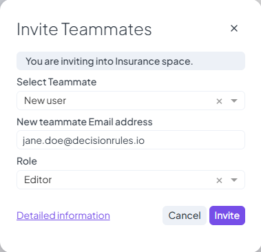

# Invitations & Permissions

Managing access to your space starts with inviting users and assigning them the appropriate level of permission. This is done through **roles**, which define what a user can see and do within a space.

***

## Inviting Users to a Space

You can invite new users to your space using invite button located at the top right corner. During the invitation process, you’ll assign the user a **role**, which determines their access level. User's role can be changed in the future.

<figure><figcaption>
Invite Member to Private Space
</figcaption></figure>

Roles can be:

* **Predefined** – Common roles like Viewer, Editor, or Admin with built-in permissions.
* **Custom** – You can create your own roles with specific permission sets tailored to your workflow.

The assigned role can be changed at any time after the invitation is sent or once the user joins the space.

> For more about managing roles:
>
> * See [Access](../space/access.md) for **private spaces**
> * See [Space Roles](../organization/space-roles.md) and [Members](../organization/members.md) for **organization spaces**

***

## How Invitations Work

Once a user is invited:

* An **invitation email** is sent to their inbox.
* A **pending invitation record** is shown on the Space Detail screen.
* If needed, you can **resend the invitation** manually.

To complete the process, the invited user must:

1. Open the invitation email and click the link.
2. Log in or create a new account.
3. They are then automatically redirected to the space they were invited to.

This ensures a secure and trackable way to onboard new collaborators into your space with the correct permissions from the start.
