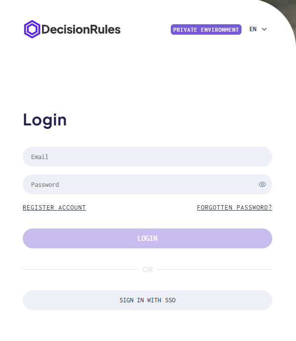

# Login on On Premise

## Login – Accessing Your Account

Existing users can log in using the same methods they registered with:

* **Email & Password** – Enter the credentials you set during registration.
* **SSO** – Choose your organization’s SSO option and follow the redirect.


You can set you [SSO in Organization Settings](../../organization/settings.md#single-sign-on-sso) or in [environment setup](/broken/pages/-Mk1RYMLVSypAkR5kVjG).


Once authenticated, you’ll be taken straight to your workspace.

<figure><figcaption></figcaption></figure>
