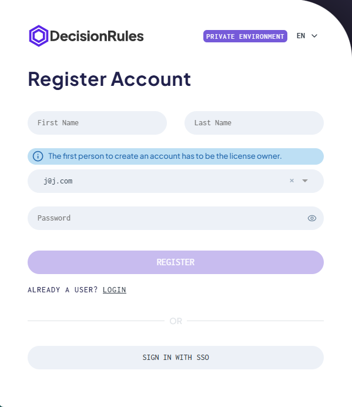

# Sign Up on On Premise

### Sign up in on-premise installations

This page describes how user registration works in self-hosted (on-premise) installations of DecisionRules.

The sign-up process depends on whether the application is already running with existing users, or whether it is a brand-new installation with no registered users yet.

### Existing installation

<figure><figcaption></figcaption></figure>

If the Decision Rules application is already running and at least one user is registered, the sign-up process works the same way as in the Cloud version.

Users can register through the registration form available on the login page. After completing registration, the user can sign in and access the application according to assigned invitations and roles.

No email verification is required unless explicitly configured by your organization.

### Initial registration (first user)

<figure><figcaption></figcaption></figure>

When Decision Rules is deployed for the first time and no users exist yet, the first registered user plays a special role.

In this case, the first user must be registered by one of the **license owners**.

The initial registration establishes the first administrative access to the application and allows further configuration, including inviting additional users and managing access.

Once the first user is registered, the application switches to the standard sign-up behavior used for existing installations.

***

### Important notes

* Only one initial registration is possible when the system has no users.
* The first registered user should always be a license owner.
* After the initial setup is completed, all further registrations follow the standard sign-up flow.
