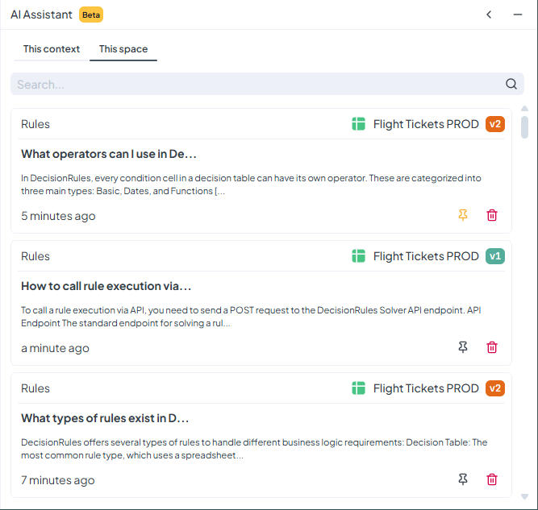

# About AI Assistant

The DecisionRules AI Assistant is a versatile, LLM-based tool designed to enhance the way business rules are created, tested, optimized, and understood within the DecisionRules platform. It provides contextual assistance directly in the application, combining general language model capabilities with DecisionRules-specific knowledge to support users throughout the rule lifecycle.

The AI Assistant offers a set of specialized agents. These agents answer platform- and rule-related questions, search the DecisionRules Documentation and Academy, highlight relevant UI elements, generate Decision Tables, prepare test input data, write and debug function expressions, and produce human-readable summaries of Decision Tables. Each agent is available in specific parts of the application and works with awareness of the current user context, such as the active page or selected Decision Table.

## Suggestions

Upon opening the AI Assistant panel, you will find a set of predefined **suggestions**. Selecting one of these options will automatically populate the input with an example prompt. The assistant will then generate a corresponding response. This feature provides a quick and guided way to understand the assistant’s behavior and output format.

## Agents

Apart from asking questions and getting answers, you can also use several predefined agents. Each agent is built for a specific task. You do not need to select one manually in most cases. The assistant will try to choose the right agent from context. If you have a specific task in mind, you can select the agent directly in the dropdown inside the chat input. This helps the assistant return more targeted output.

See more details about the available agents on the [AI Assistant Agents](ai-assistant-agents/) page.


Our team is continually extending and improving the AI Assistant. If you are missing a useful feature or agent, please contact our Sales team and we will be happy to discuss it.


## AI Assistant Chat History

AI Assistant now saves your conversations automatically. When you start a chat, the entire session is stored and can be accessed later. You no longer lose your progress after closing the panel.

#### Where to find it

Open the AI Assistant panel and click **History** in the header.

<figure><figcaption></figcaption></figure>

#### What you can do

You can:

* Open any previous session and continue the conversation.
* Search through loaded sessions by keywords from your prompts, model responses, titles, or rule names.
* Pin important sessions to keep them at the top.
* Delete sessions you no longer need.

Sessions are ordered from most recent to oldest and display a title, last message preview, and last updated time.

#### Smart navigation

When switching spaces, the history refreshes to show only relevant sessions.

## Accessing AI Assistant

The AI Assistant is currently available on **Lite Plan** or higher, and it is also included in the **Free Trial** so new users can try it out as part of our enhanced onboarding experience. It is placed in the right panel. If not already open, you can open up the assistant panel by clicking the **AI Assistant** button in the top right corner of the page.
