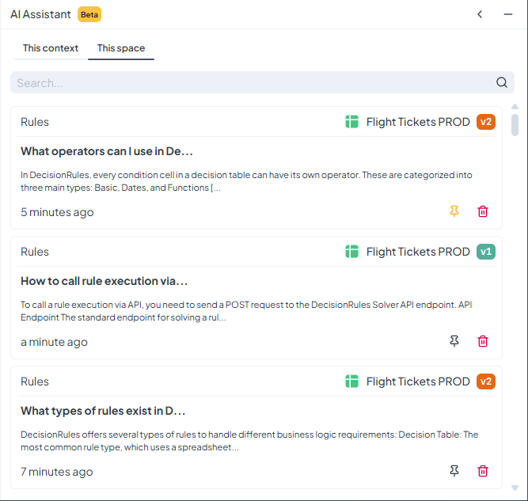

# About AI Assistant

## About AI Assistant

DecisionRules AI Assistant brings natural-language guidance and AI-assisted authoring directly into the DecisionRules application. It combines general language-model capabilities with DecisionRules-specific knowledge and the context of the page where you are working.

The Assistant can help you:

* Answer product questions using DecisionRules Documentation and Academy content
* Find pages and controls in the application
* Create Decision Tables, Scripting Rules, Lookup Tables, and Decision Flows
* Prepare reviewable changes to existing Decision Tables, Scripting Rules, and Decision Flows
* Plan and generate a complete process containing multiple rules and Decision Flows
* Generate function expressions, test inputs, test suites, and rule summaries
* Find a suitable template for a described use case

Specialized agents handle these tasks. The agents use the current page, current rule, selected Decision Table cells, attached files, and other available context when the task requires it.


Decision Flow Architect and Process Architect require DecisionRules App **1.26.2 or later** and AI Engine **1.3.0 or later** in self-hosted deployments.


### Suggestions and Follow-ups

When you open a new AI Assistant chat, predefined suggestions provide examples relevant to the current page and selected agent. Selecting a suggestion fills the input with a ready-to-use prompt.

After some responses, the Assistant may also show suggested follow-up prompts. Select one to continue the same conversation and build on the current result.

Suggestions are optional. You can always enter your own request instead.

### Agents

Each specialized agent is designed for a particular task. You usually do not need to select an agent manually because the Assistant can route a clear request to the relevant capability.

If you want to control the task directly, select an agent from the dropdown in the chat input. The available agents change according to the current page. For example, creation agents are available on the Rules List, while editing agents are shown on the corresponding rule detail page.

See [AI Assistant Features](ai-assistant-features/) for the complete feature list and availability.


Our team is continually extending and improving AI Assistant. If you are missing a useful feature or agent, contact our Sales team to discuss your use case.


### Review Before You Apply

AI-generated rule and process content is presented for review before it changes your space.

* Creating a rule requires the explicit **Import Rule** action.
* Editing a rule requires **Apply Changes**, followed by the normal **Save** action in the editor.
* Generating a process keeps all generated content as a proposal until **Import process** is selected.

Always inspect and test generated logic before saving or publishing it.

### AI Assistant Chat History

AI Assistant saves conversations automatically. You can return to a previous session after closing the panel or navigating elsewhere.

#### Where to Find It

Open the AI Assistant panel and select **History** in the header.

<figure><figcaption>
Return to an earlier AI Assistant conversation from History.
</figcaption></figure>

#### What You Can Do

You can:

* Open a previous session and continue the conversation
* Search loaded sessions by words from prompts, responses, titles, or rule names
* Pin important sessions
* Delete sessions you no longer need

Sessions are ordered from newest to oldest and show their title, latest-message preview, and last updated time.

When you switch spaces, the history refreshes to show sessions belonging to the selected space.

### Context-Aware Assistance

AI Assistant can use more than the text entered in the current prompt. Depending on the selected agent and model, its context can include:

* The current page or open rule
* Selected Decision Table cells and current Test Bench data
* Supported files attached with the attachment button, drag and drop, or clipboard paste
* Shared Space Knowledge associated with the current space
* Previous messages in the current chat session

This context helps the Assistant respond to targeted requests without requiring you to repeat the complete background every time.

### Accessing AI Assistant

AI Assistant is available on the **Lite Plan** or higher. It is also included in the **Free Trial**.

Open it from the right panel by selecting **AI Assistant** in the upper-right corner of the page.

Access also depends on the user's Space Role. The role must include the **Use AI Assistant** permission. Organization administrators can manage it under **Organization → Space Roles**.

For Cloud and self-hosted configuration, see [Assistant Setup](assistant-setup/).
