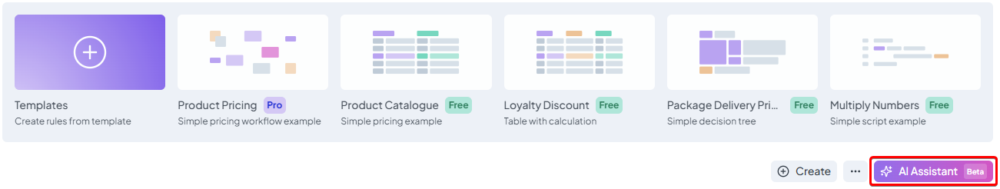
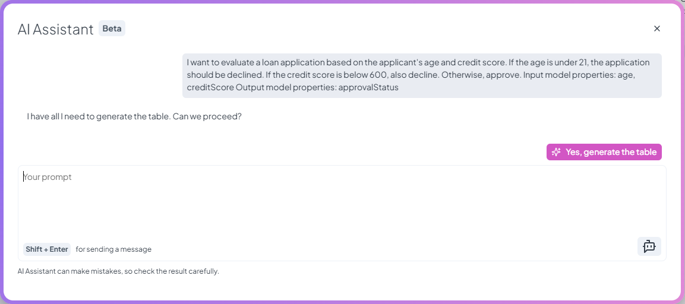
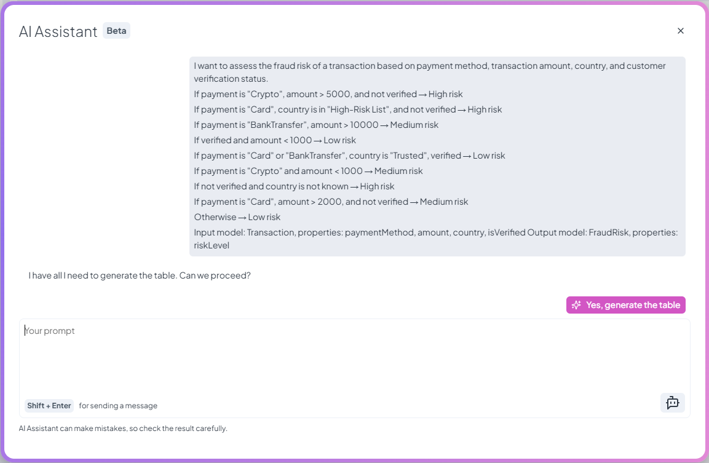

# About Assistant

We're introducing a brand-new **AI Assistant**, now available in **BETA**, designed to help users create decision rules faster—starting with **decision tables**, our most commonly used rule type. Instead of manually building a rule row by row, you can simply describe your business case, and the assistant will generate a ready-to-use decision table for you. This feature aims to simplify rule creation, especially for users who are new to the platform or working with repetitive decision logic.

<figure><figcaption>
Decision Rules AI Assistant
</figcaption></figure>

## Accessing the AI Assistant

The AI Assistant is currently available on **Business Plan** or higher, and it’s also included in the **free trial** so new users can try it out as part of our enhanced onboarding experience. You’ll find the assistant by clicking the **"AI Assistant"** button on the Rules list. From there, a prompt window will open where you can describe the logic behind your decision rule in plain language.

<figure><figcaption>
AI Assistant Access
</figcaption></figure>

## How the Prompt Works

Inside the prompt window, you’ll be guided to enter your business case and provide some **mandatory information**:

* Your case description - be as specific and clear as possible—include all important conditions and expected outcomes
* **Input Properties** – the attributes the rule will evaluate (e.g. `age`, `amount`, `status`)
* **Output Properties** – the attributes of the output model (e.g. `approvalStatus`, `interestRate`)

Once this information is provided, the assistant begins building the rule. When the rule is ready, you’ll see a message confirming it’s complete. Click "**Yes, generate the table"** to finalize the creation—then you’ll be redirected directly to the new rule for review or editing.

## Preview Cases

Upon opening the AI Assistant modal, you will find a set of predefined **preview cases** displayed as buttons. Selecting one of these options will automatically populate the prompt with a sample business scenario. The assistant will then generate a corresponding decision table based on that input. This feature provides a quick and guided way to understand the assistant’s behavior and output format.

## Prompt Examples


During the BETA phase, the AI Assistant is limited to generating decision tables with a maximum of **10 rows**. If your described case results in more scenarios, consider simplifying the logic.


1. Simple Loan Application Evaluation:

> _I want to evaluate a loan application based on the applicant's age and credit score._\
> _If the age is under 21, the application should be declined._\
> _If the credit score is below 600, also decline._\
> _Otherwise, approve._\
> _Input model properties: `age`, `creditScore`_\
> _Output model properties: `approvalStatus`_

<figure><figcaption>
Simple Table Prompt Finished
</figcaption></figure>

<figure><figcaption>
Generated Decision Table
</figcaption></figure>

2. Fraud Risk Evaluation:

> _I want to assess the fraud risk of a transaction based on payment method, transaction amount, country, and customer verification status._
>
> * _If payment is "Crypto", amount > 5000, and not verified → High risk_
> * _If payment is "Card", country is in "High-Risk List", and not verified → High risk_
> * _If payment is "BankTransfer", amount > 10000 → Medium risk_
> * _If verified and amount < 1000 → Low risk_
> * _If payment is "Card" or "BankTransfer", country is "Trusted", verified → Low risk_
> * _If payment is "Crypto" and amount < 1000 → Medium risk_
> * _If not verified and country is not known → High risk_
> * _If payment is "Card", amount > 2000, and not verified → Medium risk_
> * _Else → Low risk_
>
> _Input model properties: `paymentMethod`, `amount`, `country`, `isVerified`_\
> _Output model properties: `riskLevel`_

<figure><figcaption>
Fraud Risk Prompt Finished
</figcaption></figure>

<figure><figcaption>
Generated Decision Table
</figcaption></figure>

## About the Model and Limits

The assistant is powered by **Gemini for Business**, using the model <mark style="color:green;">`gemini-2.0-flash-lite-001`</mark>.


Your privacy is fully respected. **No user data is used to train any AI model**, and nothing is shared outside Decision Rules application. See more information about data governance [here](https://cloud.google.com/vertex-ai/generative-ai/docs/data-governance) and [here](https://cloud.google.com/gemini/docs/discover/data-governance).


Current usage limits for the assistant are defined by your **subscription plan**. If you're on a free trial, paid Business or higher tier, you'll have access to a limited number of AI generations each month.
