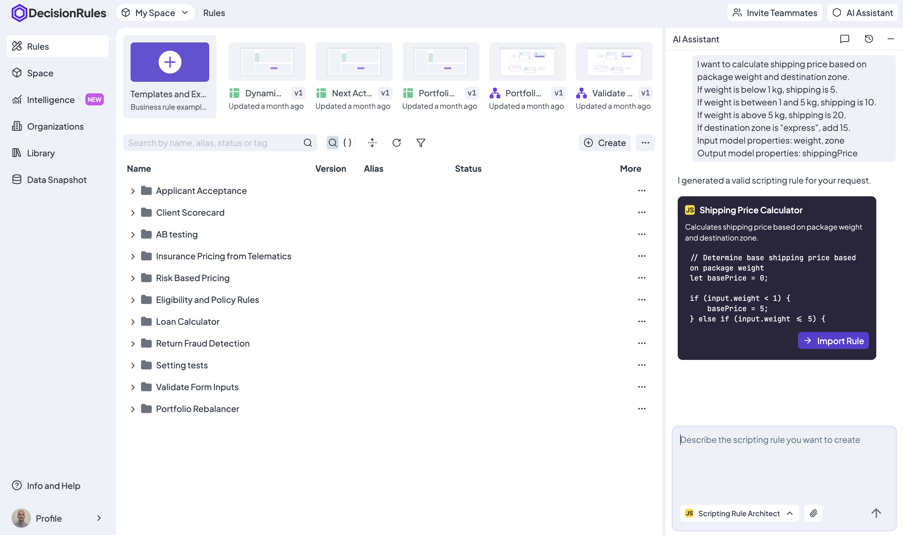
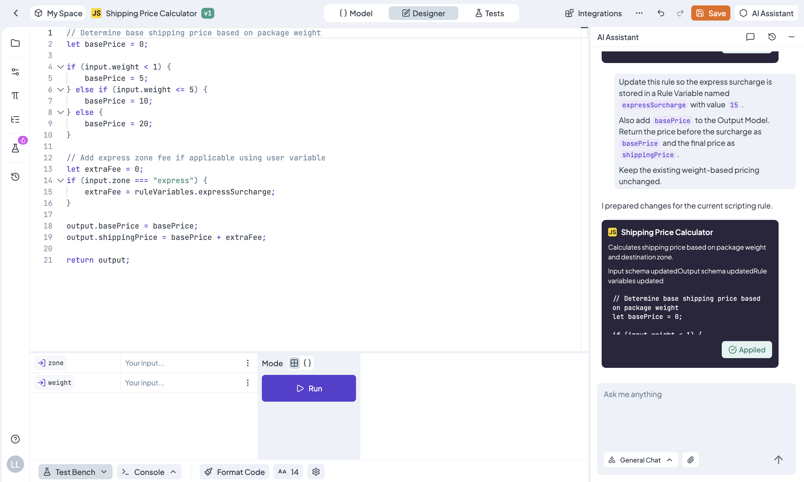

# Create and Edit Scripting Rules

Scripting Rule Architect creates new Scripting Rules and prepares changes to existing ones from natural-language instructions.

| Task                    | Availability          |
| ----------------------- | --------------------- |
| Create a Scripting Rule | Rules List            |
| Edit a Scripting Rule   | Scripting Rule Detail |

From Scripting Rule Detail, the Assistant uses the currently open rule and can update its script, Input Model, Output Model, or Rule Variables.


The clarification and authoring improvements described on this page require DecisionRules App **1.26.2 or later** and AI Engine **1.3.0 or later** in self-hosted deployments.


### When to Use a Scripting Rule

Use a Decision Table as the default for business logic that can be expressed as reviewable conditions and outcomes.

Choose a Scripting Rule when the requirement needs procedural behavior that cannot be represented clearly with declarative rules, such as specialized iteration, imperative transformations, or calling an external service from code.

Do not choose scripting only because the request is large or contains a calculation. A formula or an array can often still be represented by a Decision Table or Decision Flow.

### Create a Scripting Rule

<figure><figcaption>
Review the generated script and its models before importing the rule.
</figcaption></figure>

Open AI Assistant on the **Rules List** and select **Scripting Rule Architect**.

Describe:

* **Purpose** – what the rule should do
* **Input properties** – the data received by the rule
* **Output properties** – the values returned by the rule
* **Expected behavior** – transformations, calculations, validation, and branching
* **Edge cases** – missing values, invalid inputs, limits, and error behavior
* **Dependencies** – any existing rules or external services the script must call

If the script uses another DecisionRules rule, provide its name or alias when possible. The Assistant can inspect the space's rule structure and generate references based on existing rules.

If a material decision is missing, the Assistant asks a focused clarification question before generating the rule.

The result is validated and shown as a proposal. Select **Import Rule** only after reviewing the script and its public Input and Output Models.

#### Prompt Examples

**Normalize Product Prices**

> Create a Scripting Rule that normalizes incoming product prices.
>
> The input contains `amount`, `currency`, a `targetCurrency`, and a map of conversion rates. Reject missing or non-positive amounts. Convert the value, round it to two decimal places, and return `normalizedAmount`, `targetCurrency`, and a list of validation warnings.

**Aggregate Order Items**

> Create a Scripting Rule that receives an array of order items with `quantity` and `unitPrice`. Calculate the subtotal, reject negative quantities, apply the supplied tax rate, and return the subtotal, tax, and total.

### Edit an Existing Scripting Rule

<figure><figcaption>
Apply a reviewed proposal to the editor, then test and save the rule.
</figcaption></figure>

Open the Scripting Rule and describe the required change. The Assistant automatically uses the complete current rule as context.

For example:

> Return a validation error when `amount` is zero or negative.

> Add a `taxRate` Rule Variable and use it when calculating the final price.

> Add `normalizedPrice` to the Output Model and update the script to calculate it.

> Replace the call to `customer-score` with version 3 and preserve the existing error handling.

The Assistant can prepare changes to:

* The rule script
* The Input Model
* The Output Model
* Rule Variables

The rule identity, alias, version, and unchanged settings are preserved.

#### Review and Apply Changes

The proposal shows a script preview and indicates whether the Input Model, Output Model, or Rule Variables will also change.

Select **Apply Changes** to place the proposal into the open editor. Applying the proposal creates an Undo step but does not save the rule.


Review and test the updated Scripting Rule, then select **Save** to persist the changes.


### Tips for Better Results

* State the expected result and failure behavior.
* Use exact input, output, Rule Variable, and dependency names when possible.
* Include important edge cases.
* For a targeted update, describe only what should change.
* Request a complete rewrite only when the current implementation should be replaced.
* Test AI-generated changes before saving or publishing the rule.
