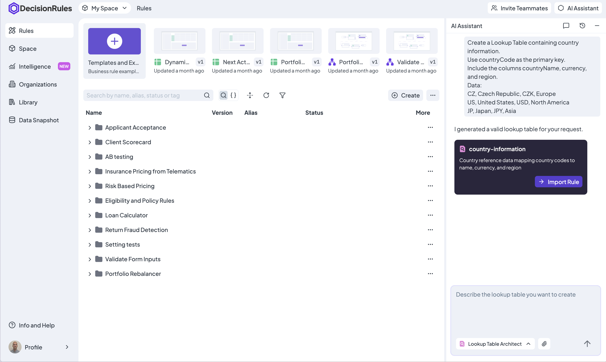
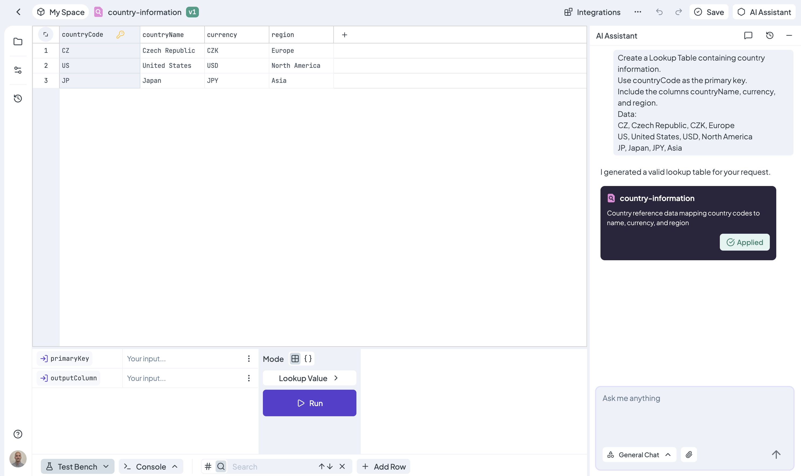

# Create Lookup Tables

Lookup Table Architect creates a new Lookup Table from written, human-readable instructions on the **Rules List**.

A Lookup Table stores fixed reference data. One primary key identifies each row, and the remaining columns contain values that can be retrieved. Common examples include product catalogs, country information, price references, customer classifications, and configuration values.

Unlike a Decision Table, a Lookup Table does not evaluate conditions or apply if-then policy.


The structured clarification improvements described on this page require DecisionRules App **1.26.2 or later** and AI Engine **1.3.0 or later** in self-hosted deployments.


<figure><figcaption>
Describe the primary key, columns, and reference rows in AI Assistant.
</figcaption></figure>

### What to Include in the Prompt

Describe:

* **Purpose** – what the Lookup Table stores or supports
* **Primary key** – the column that uniquely identifies every row
* **Columns** – the values available for each record
* **Rows** – the actual mappings or reference data

You do not need to define Input and Output Model properties. The Assistant prepares the structure required to query the Lookup Table.

Provide authoritative reference values instead of asking the Assistant to invent them. For large datasets, create the structure first and then use CSV or XLSX import.

### Create a Lookup Table

1. Open the **Rules List**.
2. Open **AI Assistant**.
3. Select **Lookup Table Architect**, or clearly request a Lookup Table.
4. Describe the columns, rows, and primary key.
5. Answer any clarification question.
6. Review the generated proposal.
7. Select **Import Rule**.

The Lookup Table is not created until you select **Import Rule**. After import, DecisionRules opens the new table so you can inspect and edit it normally.

<figure><figcaption>
Review the generated Lookup Table before selecting Import Rule.
</figcaption></figure>

### Clarification Questions

When essential data is missing, the Assistant asks for it instead of choosing a key or inventing reference values. The clarification can present suitable options together with a free-form answer.

The Assistant may ask which field is the primary key, which columns are required, or whether missing mappings should be added before generation continues.

### Prompt Examples

#### Country Reference Data

> Create a Lookup Table containing country information. Use `countryCode` as the primary key and include `countryName`, `currency`, and `region`.
>
> * CZ, Czech Republic, CZK, Europe
> * US, United States, USD, North America
> * JP, Japan, JPY, Asia

#### Product Pricing

> Create a product pricing Lookup Table. Use `productCode` as the primary key and include `productName`, `category`, and `price`.
>
> * SKU-001, Widget Pro, Electronics, 29.99
> * SKU-002, Gadget Plus, Electronics, 49.99
> * SKU-003, Tool Basic, Hardware, 15.00

### Tips for Better Results

* Identify exactly one primary-key column.
* Ensure every primary-key value is unique and non-empty.
* List all required columns and mappings.
* Use consistent number, date, code, and text formats.
* Attach a supported file when the reference data already exists in a document or spreadsheet.


Every Lookup Table must have exactly one primary key. Its values must be unique and cannot be empty.


### Lookup Table or Decision Table?

Use a **Lookup Table** when one key retrieves fixed reference values, such as a currency by country code or a price by product ID.

Use a **Decision Table** when the result depends on conditions or business policy, such as approving an application or selecting a discount.

Read [Lookup Table](../../rules/lookup-table/) for the underlying rule behavior.


Lookup Table Architect creates new Lookup Tables. It does not currently edit existing Lookup Tables through AI Assistant.

