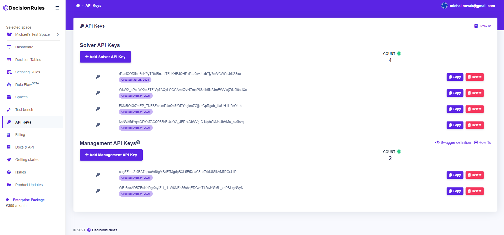

# BI API keys

To get data about the rule solver activity for business intelligence, you need to have a BI API Key.

## Getting the BI API key

You can find all your BI API Keys on the API Keys page. On this page, you can instantly copy, delete, or create a new BI API Key.

### Go to the API Keys page

To create a BI API Key, sign in and click the API Keys item in the sidebar menu.

### Create a new BI API Key

1. Go to the API Keys page
2. In the BI API Keys section, click the Add BI API Key button.


Please note that anyone with access to a Business Intelligence API Key can also inherently access your Solver keys, as Audit Logs keep record of the Solver key used for the Solver invocation.

