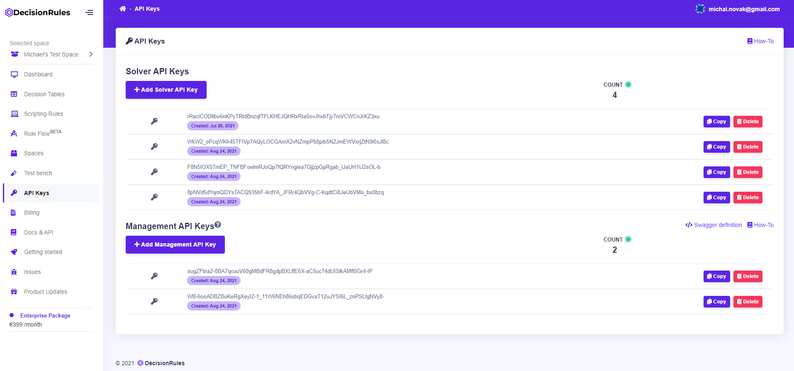

# Management API keys

To manage rules through our [Management Solver API](../management-api/) in your application, you need to have a Management API key.

## Getting the management API key

You can find all your management API keys on the API key page. On this page, you can copy, delete, or create a new management API key.

### Go to the API key page

To create a management API key, sign in, then go to API Keys item in the sidebar menu.

### Create a management API key

1. Go to API key page
2. Click on  the button. After that, a new Management API key will be created.
