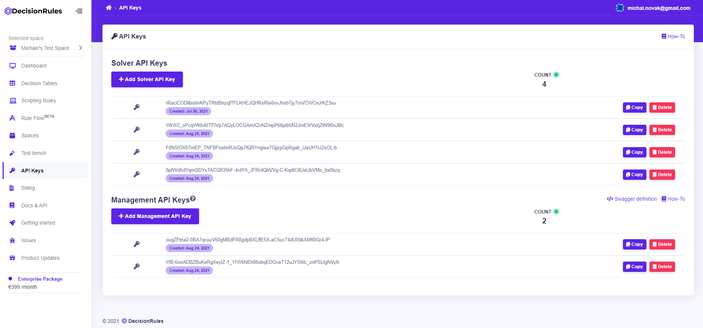

# Management API Keys

To manage rules through our API in your application, you need to have a Management API key.

management commands:

|  |  |  |
| :---: | :--- | :--- |
| GET | /rule/{ruleId} | Get rule Id |
| GET | /rule/{ruleId}/{version} | Get rule by Id and Version |
| PUT | /rule/{ruleId}/{version} | Update rule by Id and Version |
| DELETE | /rule/{ruleId}/{version} | Delete rule by Id and Version |
| POST | /rule/{spaceId} | Create rule for Space |


All important information about management commands, you can find on [https://dev.api.decisionrules.io/api/docs/](https://dev.api.decisionrules.io/api/docs/)


## Getting management API key

You can find all your management API keys on the API key page. On this page, you can copy, delete, or create a new management API key. 

### Go to the API key page

To create a management API key, sign in, then go to API Keys item in the sidebar menu.

### Creating a solver API key

1. Go to API key page
2. Click on  the button. After that, a new solver API key will be created.

