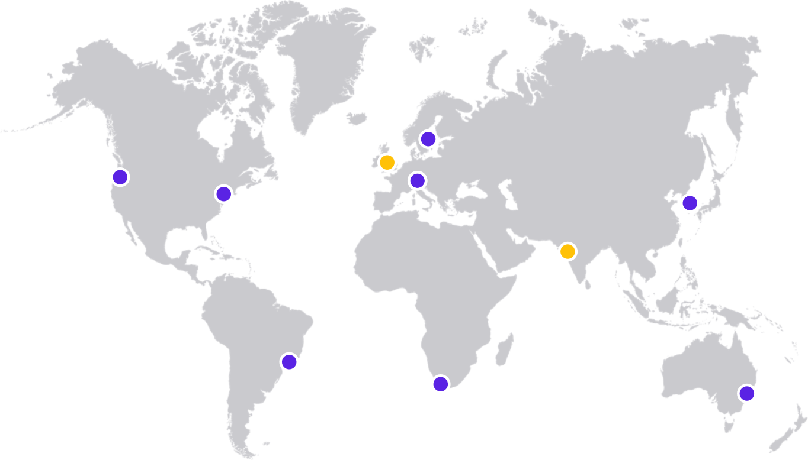

# Datacenters & Locations

DecisionRules automatically scale performance within a single location and, in the event of a failure, can immediately redirect requests to the nearest location.

### Can I reach certain location?

Decision Rules automatically selects a specific data center according to the caller's position or VPN position if used.

| Datacenter                                                               | Status                                           | Location Shorcut |
| ------------------------------------------------------------------------ | ------------------------------------------------ | ---------------- |
|  (1).png>) Central Europe (Frankfurt) | <mark style="color:green;">✓</mark> Online       | eu-central-1     |
|  (1) (1).png>) US East (N. Virginia)  | <mark style="color:green;">✓</mark> Online       | us-east-1        |
|  (1) (1).png>) US West (Oregon)       | <mark style="color:green;">✓</mark> Online       | us-west-2        |
|  (1).png>) Brazil (São Paulo)         | <mark style="color:green;">✓</mark> Online       | sa-east-1        |
|  (1).png>) Australia (Sydney)         | <mark style="color:green;">✓</mark> Online       | ap-southeast-2   |
|  (1).png>) Sweden (Stockholm)         | <mark style="color:green;">✓</mark> Online       | eu-north-1       |
| .png>) South Korea (Seoul)            | <mark style="color:green;">✓</mark> Online       | ap-northeast-1   |
| .png>) South Africa (Cape Town)  | <mark style="color:green;">✓</mark> Online       | af-south-1       |
|  (2).png>) UK (London)                | <mark style="color:yellow;">●</mark> In Progress | eu-west-2        |
|  (1).png>) India (Mumbai)             | <mark style="color:yellow;">●</mark> In Progress | ap-south-1       |


For Rule Solver set up, check our guide [**here**](rule-solver-api.md).

