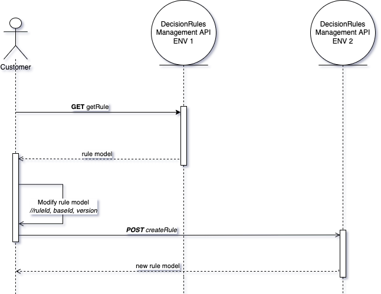
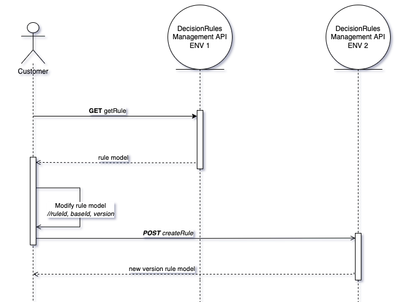
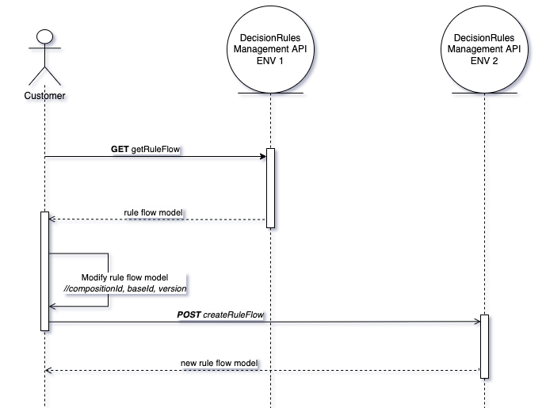
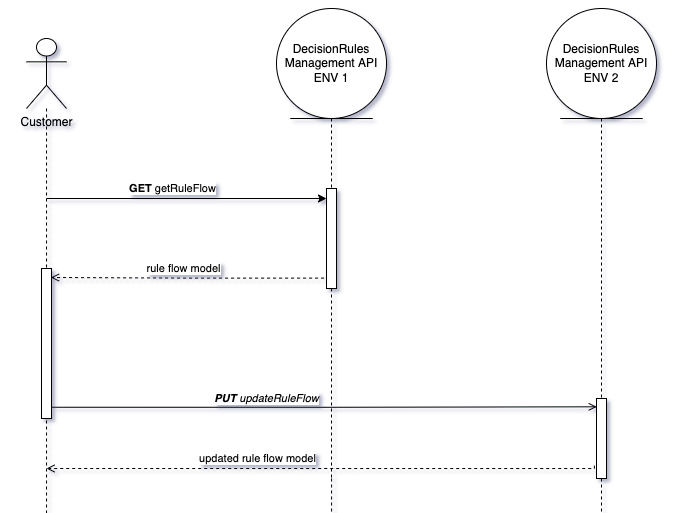
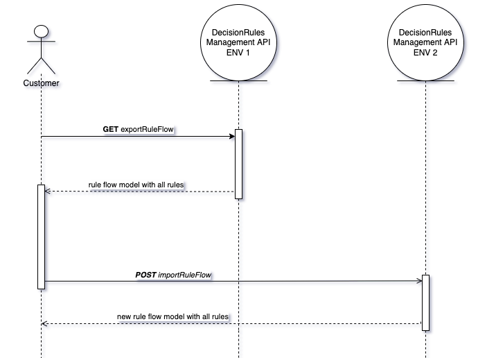
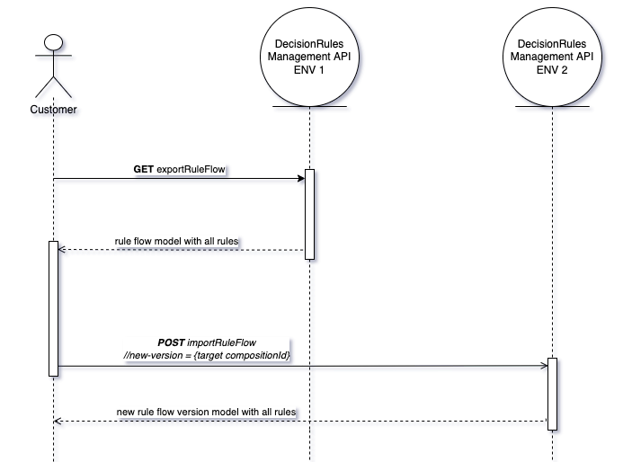
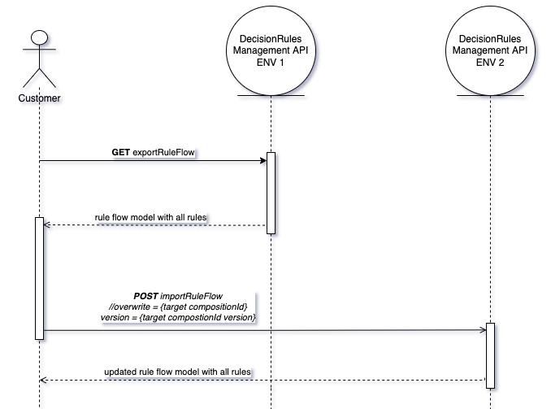

# Rule Migration Strategies


You may not need the rule migration strategies at all. Check out the [Automated Rule Migration](../../other-deployment-options/docker-and-on-premise/cd-ci-pipelines/using-migration-script-old-way.md) page for an off-the-shelf alternative.


As you might know, DecisionRules is using [Spaces](../../space/spaces.md) for rule and permission management. Within the cloud app, it is possible to share rules between Spaces or copy them from one Space to another. However, sometimes it is also needed to migrate one or more rules between two environments, either within the same database or between two different databases. This task can be performed with the use of our [Management API](../management-api.md). We have summarized the recommended strategies for rule migration in the present article.

There are two different cases of rule migration. We either want to migrate a **standalone rule** or a **complex rule**. The former applies to Decision Tables, Decision Trees and Scripting Rules. It may also apply to Rule Flows if we only wish to migrate the model and not the individual rules used in the Rule Flow (e.g. when we know they have not changed or we want to manage them separately). The latter applies to Rule Flows for which it is possible to perform the complex migration, dealing with the Rule Flow _together with_ the rules used in it. We shall treat the two migration cases separately in the two following sections.

## Migrate standalone rules

This section applies to all kinds of rules. We will only deal with the single rule model. Let us go through the individual scenarios, shortly describe the recommended procedure and provide the appropriate endpoint reference.


Note that standalone migration may break references to other rules, e.g. in the case of Rule Flows or Scripting Rules with other rules embedded in them.


### **Create a new rule**

In this scenario, we take a rule model from Environment 1, modify it as necessary and create a new rule with this model in Environment 2.

#### **Get the rule model from the source environment**

You can get your current rule model by HTTP GET method with path **/api/rule/{ruleId}/{?version}** or with the **getRule** method in the SDK.

Another option is to get the rule model using a tag. The HTTP GET method **/api/tags/items** or **getRulesByTags** method in the SDK is used for this purpose.

In any case, you get the current model of the specified rule with ruleId and version as a response.

More information about the HTTP GET methods can be found at [#get-rule](../management-api.md#get-rule "mention"). More information about the HTTP GET tag methods can be found at [#get-rules-rule-flows-by-tags](../management-api.md#get-rules-rule-flows-by-tags "mention").

#### Modify the rule model

After you get the current rule model, you have to modify it before you will create a new rule on the target environment. If you want to have the rule version equal to 1, you need to change the rule version to 1 or delete the version from the model.

If the source and target environment are on _the same database_, you have to delete ruleId and baseId from the model.

If the source and the target environments are _on different databases_ and you want to have the same ruleId, you do not need to make any changes. If you want to have a different ruleId than in the current environment, you have to delete the ruleId and baseId from the model.

#### **Create a new rule in the target environment**

After you modify the rule model, you can create it in the target environment by HTTP POST method with path **/api/rule** or with **createRule** method in the SDK. As a response, you get a new rule model with newly generated ruleId, baseId, and version. More information about the HTTP POST method can be found here at [#create-rule](../management-api.md#create-rule "mention").

### **Create a new rule version**

In this scenario, we take a rule model from Environment 1, modify it as necessary and create a new rule version with this model in Environment 2.

#### Get the  rule model from the source environment

You can get your current rule model by HTTP GET method with path **/api/rule/{ruleId}/{?version}** or with the **getRule** method in the SDK.

Another option is to get the rule model using a tag. The HTTP GET method **/api/tags/items** or **getRulesByTags** method in the SDK is used for this purpose.

You get a current model of the specified rule with ruleId and version as a response. More information about the HTTP GET methods can be found here: [#get-rule](../management-api.md#get-rule "mention"). More information about the HTTP GET tag methods can be found here: [#get-rules-rule-flows-by-tags](../management-api.md#get-rules-rule-flows-by-tags "mention").

#### Modify the rule model

After you get the current rule model you have to modify it. You set the ruleId, baseId to the ruleId, baseId of the rule whose version you want to a create. Next, you have to change the version to a new version that you wish.

#### Create a new rule version for a target environment

After you modify the rule model, you can create it in the target environment by HTTP POST method with path **/api/rule** or with **createRule** method in the SDK. As a response, you get a new rule model with newly generated ruleId, baseId, and version. More information about the HTTP POST method can be found at [#create-rule](../management-api.md#create-rule "mention").

### **Update a rule**

In this scenario, we take a rule model from Environment 1, modify it as necessary and update an existing rule in Environment 2.

.png>)

#### Get a rule model from a source environment

You can get your current rule model by HTTP GET method with path **/api/rule/{ruleId}/{?version}** or with the **getRule** method by SDK.

Another option is to get the rule model using a tag. The HTTP GET method **/api/tags/items** or **getRulesByTags** method in the SDK is used for this purpose.

You get a current model of the specified rule with ruleId and version as a response.

More information about the HTTP GET methods can be found at [#get-rule](../management-api.md#get-rule "mention"). More information about the HTTP GET tag methods can be found at [#get-rules-rule-flows-by-tags](../management-api.md#get-rules-rule-flows-by-tags "mention").

#### Modify the rule model

After you get the current rule model you have to modify it. You have to delete baseId from the rule model.

#### Update a rule in the target environment

After you modify the rule model, you can put it in the target environment by HTTP PUT method with path **/api/rule/{ruleId}/{?version}** or with **updateRule** method in the SDK.

As a response, you get a updated rule model. More information about the HTTP PUT method can be found at [#update-rule](../management-api.md#update-rule "mention").

### **Create a separate Rule Flow**

In this scenario, we take a Rule Flow model from Environment 1, modify it as necessary and create a new Rule Flow with this model in Environment 2.

#### Get a Rule Flow model from the source environment

You can get your current rule flow model by HTTP GET method with path **/api/rule-flow/{ruleFlowId}/{?version}** or with **getRuleFlow** method in the SDK.

Another option is to get the rule flow model using a tag. The HTTP GET method **/api/tags/items** or **getRulesByTags** method in the SDK is used for this purpose.

You get a current model of the specified rule flow with ruleFlowId and version as a response. More information about the HTTP GET method can be found at [#get-rule-flow](../management-api.md#get-rule-flow "mention"). More information about the HTTP GET tag methods can be found at[#get-rules-rule-flows-by-tags](../management-api.md#get-rules-rule-flows-by-tags "mention").

#### **Modify the Rule Flow model**

If you want to have a rule version from 1, you have to change the rule version to 1 or delete the version from the model.

If the source and target environment are on the same database, you have to delete compositionId and baseId from the model.

If the source and target environment are on a different database and you want to have the same compositionId, you do not make any changes. If you want to have a different compositionId than in the current environment, you have to delete the compositionId and baseId from the model.

#### Create a new Rule Flow in the target environment

After you modify the rule flow model, you can create it in the target environment by HTTP POST method with path **/api/rule-flow** or with **createRuleFlow** method in the SDK.

As a response, you get a new rule flow model with newly generated compositionId, baseId, and version. More information about the HTTP POST method can be found at [#create-rule-flow](../management-api.md#create-rule-flow "mention").

### **Create a new separate Rule Flow version**

In this scenario, we take a Rule Flow model from Environment 1, modify it as necessary and create a new Rule Flow version with this model in Environment 2.

 (1).png>)

#### Get a Rule Flow model from the source environment

You can get your current rule flow model by HTTP GET method with path **/api/rule-flow/{ruleFlowId}/{?version}** or with **getRuleFlow** method by SDK.

Another option is to get the rule flow model using a tag. The HTTP GET method **/api/tags/items** or **getRulesByTags** method by SDK is used for this purpose.

You get a current model of the specified rule flow with ruleFlowId and version as a response. More information about the HTTP GET method can be found at [#get-rule-flow](../management-api.md#get-rule-flow "mention"). More information about the HTTP GET tag methods can be found at [#get-rules-rule-flows-by-tags](../management-api.md#get-rules-rule-flows-by-tags "mention").

#### **Modify the Rule Flow model**

After you get the current rule model you have to modify it. You have to change compositionId, baseId to a compositionId which version you want to a create. Next, you have to change the version to a new version that you want.

#### Create a new Rule Flow version in the target environment

After you modify the rule flow model, you can create it in the target environment by HTTP POST method with path **/api/rule-flow** or with **createRuleFlow** method by SDK.

As a response, you get a new rule flow model with newly generated compositionId, baseId, and version. More information about the HTTP POST method can be found at [#create-rule-flow](../management-api.md#create-rule-flow "mention").

### Update a separate Rule Flow

In this scenario, we take a Rule Flow model from Environment 1, modify it as necessary and update an existing Rule Flow in Environment 2.

#### Get a Rule Flow model from the source environment

You can get your current rule flow model by HTTP GET method with path **/api/rule-flow/{ruleFlowId}/{?version}** or with **getRuleFlow** method by SDK.

Another option is to get the rule flow model using a tag. The HTTP GET method **/api/tags/items** or **getRulesByTags** method by SDK is used for this purpose.

You get a current model of the specified rule flow with ruleFlowId and version as a response. More information about the HTTP GET method can be found at [#get-rule-flow](../management-api.md#get-rule-flow "mention"). More information about the HTTP GET tag methods can be found at [#get-rules-rule-flows-by-tags](../management-api.md#get-rules-rule-flows-by-tags "mention").

#### **Update a Rule Flow in the target environment**

You can create it in the target environment by HTTP PUT method with path **/api/rule-flow/{compositionId}/{?version}** or with **updateRule** method in the SDK.  As a response, you get a updated rule flow model. More information about the HTTP PUT method can be found at [#update-rule-flow](../management-api.md#update-rule-flow "mention").

## Migrate complex rules

Currently, the complex rule migration is only supported for Rule Flows. Use it if you wish to migrate a Rule Flow together with all the rules that it uses. We shall go through the individual scenarios, shortly describe the recommended procedure and provide the appropriate endpoint reference.

### **Create a Rule Flow with rules**

In this scenario, we take a Rule Flow model together wit all the rules used in it from Environment 1 and create a new Rule Flow in Environment 2.

#### **Get a Rule Flow model with rules from the source environment**

You can get your current rule flow model by HTTP GET method with path **/api/rule-flow/export/{ruleFlowId}/{?version}** or with **exportRuleFlow** method in the SDK.

You get a current model of the specified rule flow with all rules as a response. More information about the HTTP GET method can be found at [#export-rule-flow-with-all-rules](../management-api.md#export-rule-flow-with-all-rules "mention").

#### **Create a new Rule Flow with rules in the target environment**

You can create it in the target environment by HTTP POST method with path **/api/rule-flow/import** or with **importRuleFlow** method in the SDK.

As a response, you get a new rule flow model with all rules. More information about the HTTP POST method can be found at [#import-rule-flow-with-all-rules](../management-api.md#import-rule-flow-with-all-rules "mention").

### **Create a new Rule Flow version with rules**

In this scenario, we take a Rule Flow model together wit all the rules used in it from Environment 1 and create a new Rule Flow version in Environment 2.

#### Get a Rule Flow model with rules from the source environment

You can get your current rule flow model by HTTP GET method with path **/api/rule-flow/export/{ruleFlowId}/{?version}** or with **exportRuleFlow** method by SDK.

You get a current model of the specified rule flow with all rules as a response. More information about the HTTP GET method can be found at [#export-rule-flow-with-all-rules](../management-api.md#export-rule-flow-with-all-rules "mention").

#### Create a new Rule Flow version with rules for the target environment

You can create it in the target environment by HTTP POST method with path **/api/rule-flow/import** or with **importRuleFlow** method in the SDK. You have to call this method with the parameter **new-version** with a value of **compositionId** which new version you want to create.

As a response, you get a new rule flow model with all rules. More information about the HTTP POST method can be found at [#import-rule-flow-with-all-rules](../management-api.md#import-rule-flow-with-all-rules "mention").

### **Update a Rule Flow with rules**

In this scenario, we take a Rule Flow model together wit all the rules used in it from Environment 1 and update an existing Rule Flow in Environment 2.

#### Get a Rule Flow model with rules from the source environment

You can get your current rule flow model by HTTP GET method with path **/api/rule-flow/export/{ruleFlowId}/{?version}** or with **exportRuleFlow** method by SDK.

You get a current model of the specified rule flow with all rules as a response. More information about the HTTP GET method can be found at [#export-rule-flow-with-all-rules](../management-api.md#export-rule-flow-with-all-rules "mention").

#### Update a Rule Flow with rules in the target environment

After you modify the rule flow model, you can create it in the target environment by HTTP POST method with path **/api/rule-flow/import** or with i**mportRuleFlow** method by SDK. You have to call this method with the parameter **overwrite** with a value of **compositionId** and parameter **version** with **the value of the version** which rule flow you want to update.

As a response, you get a updated rule flow model with all rules. More information about the HTTP POST method can be found at [#import-rule-flow-with-all-rules](../management-api.md#import-rule-flow-with-all-rules "mention").
