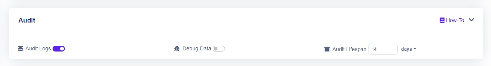
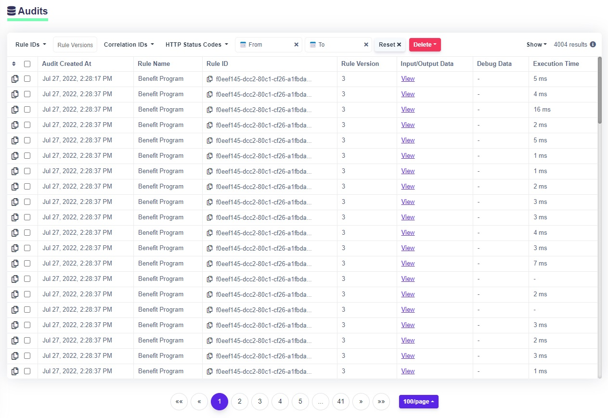

# Audit Logs

&#x20;DecisionRules allows you to generate audit logs from the solver which is extremely useful for getting overview about your decisions and performing analyses. On this page, we shall summarize all that you need to know about this topic.

## About Audit Logs

We shall take you through the process of getting started with Audit Logs step by step. If you already have some audit logs and need some hints on their management, please skip to the last section.

### Activate Audit Logs

To start using Audit Logs, you first need to activate them. Open your user menu (top right corner of the page) and choose Plans. Switch to the Add-Ons tab where you can find the Audit Logs Add-On and click Activate. This will create a new monthly subscription for you. At the end of the month, you will be charged a small amount for every audit log stored in the database. That is, you are not charged anything until you actually generate and store some logs.


We suggest to store only those audit logs that you really need, with the lifespan that you need. Nevertheless, for testing purposes, you may activate and start using Audit Logs without worries. Unless you generate thousands of logs, you will be fine. When you are done testing, just delete all logs so you do not pay for them any more.


### Turn on Audit Logs on a rule

Audit Logs have to be turned on individually on each rule that you want to have logs from. This guarantees that you do not generate (and pay for) logs that you are actually not interested about. To turn on Audit Logs on a rule (e.g. a decision table), go to its rule settings and open the Audit Logs section. There, click the **Audit Logs** slider. If you wish to include additional debug data into the logs (more on these below), you may switch the corresponding slider on. Finally, you may set the audit log lifespan, i.e., the time for which the logs will be persisted. Once the lifespan is over, the logs will be automatically disposed.


If you ever decide to deactivate the Audit Logs add-on, beware that all your audits will be disposed. This action is irreversible. Thus, if you have logs that you do not want to lose, **be sure not to deactivate Audit Logs**. Alternatively, you may fetch your logs via the [Business Intelligence API](../api/bi-api/) and create a private backup.



If you are in production environment, choose the audit log lifespan wisely. When the log is generated, its lifespan cannot be changed anymore. Even more importantly, once it is disposed, it **cannot be recovered**.


#### Debug Data

By default, audit logs contain metadata (timestamp, rule ID, rule type, etc.) plus the input and output data that is very useful for analyzing decisions. Meanwhile, Debug Data provide a more detailed description of the rule solver run itself. They contain the same information that you see in the Console when you call a rule from Test Bench with Debug Mode on (if you are not yet familiar with [Test Bench](../other/test-bench.md), read on). Having these data can be useful in the process of debugging, because you can see the evaluation of individual conditions.

### Call the solver

To generate audit logs, you will need to call the solver. Go to the rule where you have Audit Logs turned on, make sure its state is set to **Published** and open Test Bench (at the bottom of the page). Now enter some input data (on the left side) and hit Run. Congratulations, you have just generated your first audit log.

### View your audit logs

By now you should have generated some audit logs: let's take a look at them. Click **Audit Logs** in the menu on the left and check out the table. You should see some entries there. Each row represents one audit log. If you have more logs than can fit on one page, use the paginator below the table to navigate between pages.


**Limitations**

Audit logs which exceed the allowed memory limit will not have all of it's contents displayed. Namely the Input Data, Output Data and Debug Data fields will be omitted.

The memory limit for each Audit Log is inversely correlated with the amount of Audit Logs being displayed. To display all of the data of extensive Audit Logs, try lower the amount of Audit Logs displayed or use the filter feature to display only the Audit Log in question.

**For On-Premise solutions**:

The memory limit can be set as an environment variable, where the size of the limit is given in bytes. The default value is set to 130MB.


#### Reading audit logs

By default, you see several columns in the table representing individual properties of the logs (time of creation of the audit, rule name, etc.). You may set up the view by clicking the **Show** dropdown in the right of the table header and choosing which columns to display. To view the input and output data (or the data models), click the corresponding cell and you will be shown a modal with JSON. The data can be copied to clipboard by clicking the copy icon. The same holds for the whole audit log (use the copy icon at the beginning of each row).

#### Filtering audit logs

Let us quickly go through the filtering options. First and foremost, you may filter logs by rule IDs. Just click the Rule IDs dropdown in the header of the table and choose the rule(s) you are interested in. You may also enter one or more rule versions. Next you can filter by correlation IDs (correlation ID is an identifier that can be passed to the rule solver when calling it in order to identify the rule solve within some wider integrated process). When you are looking for errors, you may want to filter by HTTP status codes. Eventually, there is a time filter allowing to look at a specified time period. You may reset all filters by clicking the respective button.

#### Deleting audit logs

Since you are being charged for the logs stored in the database, it is convenient to be able to delete them. You can do that in three ways. To delete all audits, reset the filter, click the Delete button and choose **Delete All**. This will delete all audits belonging to your Space. For a slightly more specific delete, you may set up a filter (according to the preceding paragraph), click the Delete button and choose **Delete Filtered**. This will delete all the audits in your Space matching the filter. Finally, for the most delicate deletion, you may select the entries manually using the checkbox at the beginning of each row, click Delete and choose **Delete Selected**. This will delete only the logs in selection.

### What next

* Lear more about [Business Intelligence API](../api/bi-api/) which allows you to fetch audit logs.
* If you would like to load your audit logs to Power BI, follow our [Power BI Tutorial](../tutorials/create-a-power-bi-report.md).
