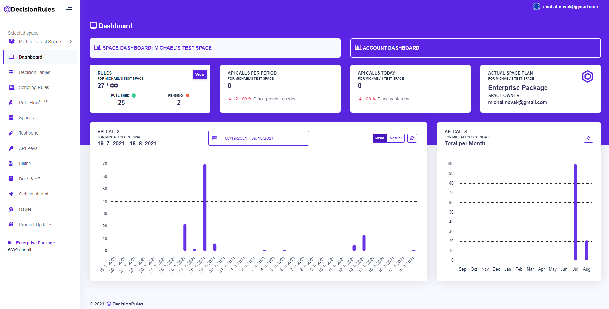
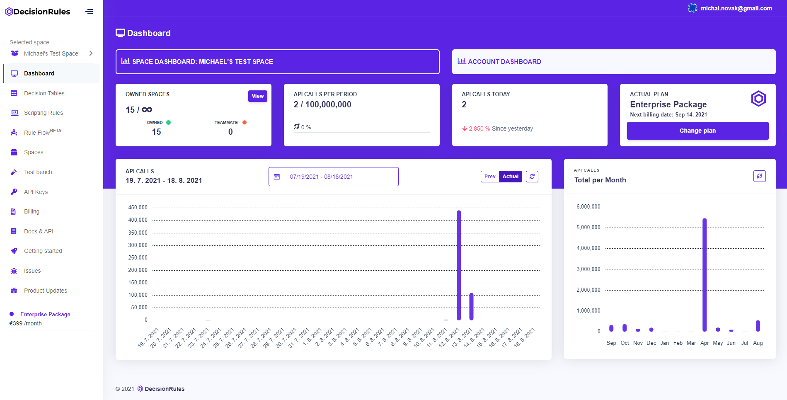

# Dashboard

The **dashboard** is the first screen that welcomes you to DecisionRules.io application. It displays the main information and statistics on the **widgets** and **graphs**. Each user can have multiple spaces, so the dashboard is separated into 2 parts - information about the whole account or just about the space.

### Space dashboard

It displays the main information and statistics about the space the user is currently in.  To display the information of another space, it is necessary to switch the space

### Widgets on Space dashboard

* **Rules -** displays the total number of rules in the space against the maximum of the billing plan and their state.
* **API calls per period -** displays the number of API calls in the actual billing period and a percentage increase/decrease compared to the last period \(month\).
* **API calls today -** displays today's amount of API calls and a percentage increase/decrease compared to yesterday.
* **Actual Plan -** displays the actual subscribed billing plan and the name of the space owner.


Every space has only one owner and the space package is based on the space owner subscription plan.


### Account dashboard

The account dashboard displays the main information and statistics about the whole user's account. All the API calls information is summed up of all the spaces owned by the user.


Everyone only sees their own account dashboard. You can not view your teammate's account dashboard.


### Widgets on Account space

* **Owned spaces -** displays the number of spaces against the billing plan.
* **API calls today -** displays today's amount of API calls and percentage of usage against the billing plan.
* **API calls today -** displays today's amount of API calls and a percentage increase/decrease compared to yesterday.
* **Actual Plan -** displays the actual subscribed billing plan and the next billing date of the user account.

### Graphs

The first graph shows the number of API calls in the current and previous billing periods for the day or in any other time period using the calendar button.

The second graph shows the total number of API calls per month in the last 12 months.

### 

