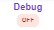
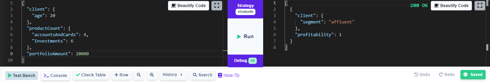
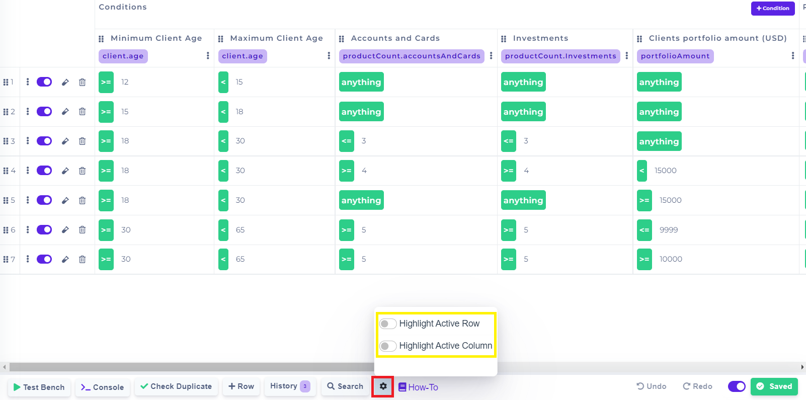

# Table Designer

A table designer is the heart of decision tables. In this section, you can easily create your business rules, then link them to input and output data. Business rules are created to easily design or change the rules and deploy them quickly.

.png>)

#### Applying changes

For every changes applied, there is a need to save them.\
Then it is important to click on button.


All the changes are made to the current table version.


## Conditions

Conditions are used to define input values.

### Adding Conditions

To add a new condition, click on .png>) button. After that, a new condition will be created.

### Select value from Input Model

It is necessary to select some value from the Input Model.\
To do this, click on .png>) button under the condition name. All possible values will be expanded, and then you can select one of them


More information is in the [Binding To Model](binding-to-model.md).


### Delete Condition

To delete the condition from the Designer, click on .png>) button.

## Results

Results are used to define output values.

### Adding Result

To add a new result, click on .png>) button. After that, a new result will be created.

### Select value from Output Model

It is necessary to select some value from the Output Model.\
To do this, click on.png>)button under the condition name. All possible values will be collapsed, and then you can select one of them.


More information is in [Binding To Model](binding-to-model.md).


### Delete Result

To delete results from the Designer, click on.png>)button.

## Row

A row represents one rule for specified data. If it's called [Rule Solver](../api/rule-solver-api.md) or [Test Bench](../test-bench/test-bench.md) with Input Data corresponding to **conditions** in a row, the[ Rule Solver](../api/rule-solver-api.md) or [Test Bench](../test-bench/test-bench.md) response will have the same data specified in **results** in the corresponding row.

### Adding Row

To add a new row, click on  button. After that, a new row will be created.

### Fill Condition cell

For every condition cell, it is necessary to select **Operator** and **Value** if it is allowed.\
Possible operators are specified in [Operators](operators/), and possible values for data types are specified in [Data Types](data-types.md).

### Fill Result cell

A possible result for data types is specified in[ Data Types](data-types.md).\
To fill the result cell value, click on the existing value, then enter a new value.

### Copy Row

To copy a row, click on.png>)the button. After that, select one of the copy options, then the row will be copied. The copied row will have the same set of rules.

### Clear Row

To clear all sets of conditions and result values, click on.png>)the button. After that, select **Clear Row,** then all values in the row will be cleared.

### Inactive and Active Row

To Inactive the row, click on the  button. After that, the button changes to. To reactive row click on the button again.


By default all the rows in the tables are **ACTIVE.** This functionality can be used when you don't want to use the line in the rule for validation, but you might need to use it in the future.

If the row is **INACTIVE** it behaves in the same way, as it wouldn't be there.


### Delete Row

There are two options for deleting a row from the designer:

* Click on.png>)the button.
* Click on.png>)the button. After that, select **Delete Row**.

### Use Row in Test Bench

There are two options to use a row in **Test Bench**:

* Click on.png>) button
* Click on.png>) the button. After that, select **Use in Test Bench**.

After using one of the options, the row is copied to the [Test Bench](../test-bench/test-bench.md) at the bottom of the page.

### Change the order of Rows

To change the position of the row, click on.png>) the button. After that, select **Move.**

It will open new modal, where you can specify the new position of selected row.

.png>)

### Time row validation

You can specify in which time period the row will be active and when it will not be active. To set the time validation, click on the  button. You will then be presented with a new modal where you can select a time range **from** and **to**.&#x20;

.png>)

**Date** and **GMT** must be set, time is optional.


By default all rows are not **time limited**, so they will **always be evaluated**. If time validation is set, the row will only **be evaluated in the set period.**


Other features which DecisionRules helps you to make your work more efficient and easier.

## Check Table

Check table is on the bottom of the page as a clickable button. By clicking on this button it compares the input values in the table. If it finds rows, which are the same it highlights them. It works only on the input model, the output model can be the same.

.png>)

## Debug

The debug button  is on the test bench shown on the bottom of the table designer. By default debug mode is turned off, by clicking on it the user turns it on.

The debug mode is used for showing the rows in the table which meet the input. It highlights the row with green color.

.png>)


For a larger view of the test bench, you can use the maximize button in the right corner. Looks like this: 


## AutoSave button

The AutoSave button  (1).png>) is located on the bottom of the Decision Tables page, next to the button  (1).png>) /  (1) (1).png>).

### Highlight the active columns and rows

If you are getting lost between columns and rows, there is an option to highlight active rows and columns. This function is hidden under the button  (1) (1).png>)in the navigation toolbar in the bottom of Decision Tables.

Choose what you want to get highlighted and activate the option. The row/ column will be highlighted with light green - as it is demonstrated in the picture below.

.png>)

## Undo & Redo

There is a local history of every change in this designer.\
It is possible to undo or redo change by clicking on .png>)or.png>)button.
