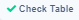
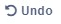

# Table Designer

## Information

Table designer is the heart of decision tables. In this section, you can easily create your business rules, then link them to input and output data. Business rules are created to easily design or change the rules and deploy them quickly.

#### Applying changes

For every changes applied, there is a need to save them.  
Then it is important to click on button.


All the changes are made to the current table version.


## Conditions

Conditions are used to define input values.

### Adding Conditions

To add a new condition, click on  button. After that, a new condition will be created.

### Select value from Input Model

It is necessary to select some value from the Input Model.  
To do this, click on  button under the condition name. All possible values will be expanded, and then you can select one of them 


More information is in the [Binding To Model](binding-to-model.md).


### Delete Condition

To delete condition from the Designer, click on  button.

## Results

Results are used to define output values.

### Adding Result

To add a new result, click on  button. After that, a new result will be created.

### Select value from Output Model

It is necessary to select some value from the Output Model.  
To do this, click onbutton under condition name. All possible values will be collapsed, and then you can select one of them. 


More information is in [Binding To Model](binding-to-model.md).


### Delete Result

To delete result from the Designer, click onbutton.

## Row

Row represents one rule for specified data. If its called [Rule Solver](../api/rest-api.md) or [Test Bench](../test-bench/test-bench.md) with Input Data corresponding to **conditions** in row, the[ Rule Solver](../api/rest-api.md) or [Test Bench](../test-bench/test-bench.md) response will have the same data specified in **result** in the corresponding row.

### Adding Row

To add a new row, click on  button. After that, a new row will be created.

### Fill Condition cell

For every condition cell, it is necessary to select **Operator** and **Value** if it is allowed.   
Possible operators are specified in [Operators](operators/), and possible value for data types are specified in [Data Types](data-types.md).

### Fill Result cell

Possible result for data types are specified in[ Data Types](data-types.md).  
To fill the result cell value, click on the existing value, then enter a new value.

### Copy Row

To copy a row, click onbutton. After that, select one of the copy options, then the row will be copied. The copied row will have the same set rules.

### Clear Row

To clear all sets conditions and result values, click onbutton. After that, select **Clear Row,** then all values in the row will be cleared.

### Delete Row

There are two options for deleting a row from the designer:

* Click on button.
* Click on button . After that, select **Delete Row**.

### Use Row in Test Bench

There are two options to use a row in **Test Bench**:

* Click on button  
* Click on button . After that, select **Use in Test Bench**.

After using one of the options, the row is copied to the [Test Bench](../test-bench/test-bench.md) at the bottom of the page.

### Change the order of Rows

To change the position of the row, drag the row on  symbol and drop it on the specified place.

## Other

Other features which DecisionRules helps you to to make your work more efficient and easier.

### Check Table

Check table is on the bottom of the page as a clickable button  . By clicking on this button it compares the input values in the table. If it finds rows, which are the same it highlights them. It works only on the input model, the output model can be the same.

### Debug

Debug button  is on the test bench shown on the bottom of the table designer. By default debug mode is turned off, by clicking on it the user turns it on. 

The debug mode is used for showing the rows in the table which meet the input. It highlights the row with green color.

## Undo & Redo

There is a local history of every change in this designer.  
It is possible to undo or redo change by clicking on orbutton.  

