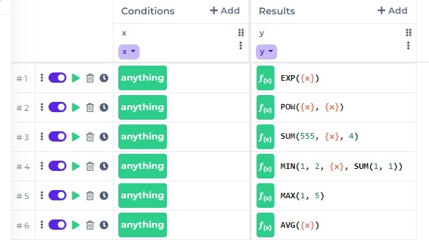
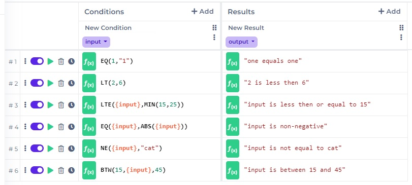

# Functions

Functions can be used in [Decision Tables](../decision-table-designer.md) and [Decision Trees](broken-reference) to write mathematical and other functional expressions, both in the conditions and results. On this introductory page, you can make yourself familiar with the basic principals of writing functions in DecisionRules. The detailed documentation of all the available functions is provided on the subsequent pages.

<figure><figcaption><p>How functions can be used in a decision table</p></figcaption></figure>

## About functions

We are constantly maintaining and improving our functions to provide the best user experience while keeping all changes backwards compatible. Functions are divided into several categories with respect to the area of their application. The categories are the following:

* Math functions
* Logical functions
* Date and time functions
* Text functions
* Data functions
* Array functions
* Integration functions

### General usage

DecisionRules Functions have a wide range of applications and behavior, however, there are some basic principals that apply universally. Let us give a brief exposition of these principals supported by basic practical examples. For more examples and information about the behavior of the individual functions, see their respective documentation.

#### Syntax

The functions syntax is quite simple. Functions are denoted by their names (always uppercase, sometimes including underscores) and brackets that enclose individual function arguments separated by comma.

```javascript
SUM(1,4,5)
```

Each function can take different number of arguments, some of which may be optional. There are even functions that do not need any argument at all.

```javascript
NOW()
```

#### Values

DecisionRules supports several distinct data types. There are primitive values: number, string, boolean, and null. There are also complex types like arrays and objects. Within functions, we support several additional types like date or regular expression. More information on data types within DecisionRules can be found on the [Supported Data Types](../data-types.md) page. Here, let us only recall the basic syntax.

```json
12.1          --> number
"abc"         --> string
true          --> boolean
false         --> boolean
null          --> null
```


As you can see above, strings are standardly entered in double quotes. In case of simple string expressions that do not contain special characters \[\*/+-(),%{}], it is possible to omit the quotes. Nevertheless, we recommend to keep them for clarity and consistency.


If you need to use the double quotes character as part of a string, you can alternatively employ single quotes to define the string. Functions also support basic escaping of double quotes, simple quotes and backslashes:

```json
"abcd"        --> abcd
'ab"cd'       --> ab"cd
"ab\"cd"      --> ab"cd
"ab\'cd"      --> ab'cd
"ab'cd"       --> ab'cd
"ab\\cd"      --> ab\cd
```

Functions are usually defined in such a way that they cast the given value to the correct type themselves wherever it is possible, so that the user does not have to pay attention to the types. Let us take once again the example of the familiar function SUM which returns the sum of its arguments. By nature, SUM should of course take numbers as arguments.

```json
SUM(1,4,5)      --> 10
```

Nevertheless, when given numerical values as strings, it treats them correctly, too.

```json
SUM(1,4,"5")    --> 10
```

Of course, it is not always possible to cast values to the required type. If this happens, the expression will either not pass validation or fail during execution. Most errors in this regard can be avoided by simply using functions in accordance with the documentation.

```json
SUM(1,4,"abc")    --> invalid
```

Some functions allow or even require complex data types: arrays and objects. In fact, the former holds for SUM which accepts arrays as arguments. Below you can see SUM given a single argument, which is an array of numbers. It sums up the numbers inside the array and returns the correct result.

```json
SUM([1,4,5])    --> 10
```

DecisionRules uses JSON syntax for arrays and objects. It is easy to understand and work with. See a couple of basic examples below.

```json
[1,4,5]                      --> array with 3 elements, all numbers
["a","b"]                    --> array with 2 elements, both strings
[]                           --> empty array
[{"id":"A5B52","price":45}]  --> array whose element is an object
{"id":"A5B52","price":45}    --> object with 2 key-value pairs
{"animals":["cat","dog"]}    --> object with key "animals" whose value is an array
{}                           --> empty object
```

#### Nesting

Functions can be nested inside each other.

```json
SUM(MAX(1,2),1)    --> 3
```

Here, the MAX function returns the maximum of its elements, which is 2, and this result is then passed to the SUM function, which adds it up with 1 and returns 3.

#### Variables

DecisionRules Functions have special syntax for variables. There are four kinds of variables that may enter in functions. Let us briefly describe each of them.

* Input variables. These represent the rule input data, as defined by the [Input model](../input-and-output/).
* Output variables. These represent the rule output data, as defined by the [Output model](../input-and-output/).
* Rule variables. These are user defined values with the scope of the rule. [See more here](../../other/rule-variables.md).
* Abstract function variables. These are special variables used in certain [functions](array.md#map-array-to-another-array-array\_map).

The particular kind and usage of the variable is not important for now since they are all used in the same way. Just write the name of the variable in curly brackets, anywhere you want to use it. The value saved in the variable will be picked up by the rule solver and used to evaluate the expression.

```javascript
number = 3

SUM({number},6)   --> 9
```

Of course, it may happen that the value coming from the variable cannot be used. Then, the evaluation will simply fail and return an empty value.

```javascript
number = "a"

SUM({number},6)   --> null
```

### Functions in decision tables

Decision tables have two types of columns, condition columns and result columns. Both can use functions but there is one basic distinction. While the cells in result columns can use functions without any limitations (because you may put anything in your results), the cells in condition columns may, by their nature, only contain functions that evaluate to boolean values, that is, their result has to be true or false. Therefore, functions in condition cells of a decision table usually employ some [Logical function](logical.md) that wraps the rest of the expression.

<figure><figcaption><p>Example of functions in the condition cells</p></figcaption></figure>

When using functions in a decision table, you can turn on the Debug Mode and open the Console to see the detail of how they evaluated.
