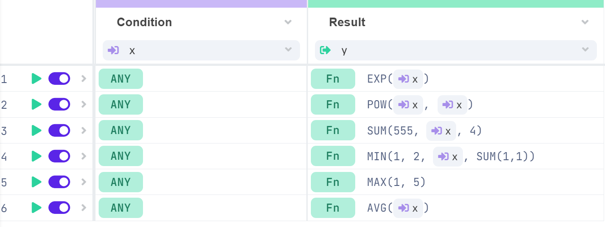

# Advanced Functions

A list of functions is a feature that can be used in the [Decision Tables ](../decision-table-designer.md)to create functions both in input and output.

## Usage of advanced functions

There are 6 types of functions in the list that can be used in the Decision Tables:

| [**Math**](math.md) | [**Logical**](logical.md) | [**Date and Time**](date-and-time.md) | [**Text**](text.md) | ****[**Data**](text.md)**** | ****[**Array**](array.md)**** |
| :-----------------: | :-----------------------: | :-----------------------------------: | :-----------------: | :-------------------------: | :---------------------------: |
|         SUM         |           EQUAL           |                  NOW                  |     UPPER\_CASE     |             PICK            |           ARRAY\_SUM          |
|         MIN         |          GREATER          |                CURDATE                |     LOWER\_CASE     |                             |         ARRAY\_CONCAT         |
|         MAX         |       GREATER\_EQUAL      |                CURTIME                |       REPLACE       |                             |       ARRAY\_CONCAT\_WS       |
|         AVG         |            LESS           |                  DATE                 |         LEN         |                             |          ARRAY\_PICK          |
|        COUNT        |        LESS\_EQUAL        |                DATEDIFF               |        CONCAT       |                             |           ARRAY\_MAP          |
|        MEDIAN       |         NOT\_EQUAL        |             DATE\_COMPUTE             |      CONCAT\_WS     |                             |           ARRAY\_AND          |
|       CEILING       |          BETWEEN          |                                       |     STRINGFORMAT    |                             |           ARRAY\_OR           |
|        FLOOR        |            AND            |                                       |                     |                             |                               |
|        ROUND        |             OR            |                                       |                     |                             |                               |
|         EXP         |           REGEXP          |                                       |                     |                             |                               |
|         POW         |          IS\_NULL         |                                       |                     |                             |                               |
|       + (plus)      |       IS\_NOT\_NULL       |                                       |                     |                             |                               |
|      − (minus)      |                           |                                       |                     |                             |                               |
|      / (divide)     |                           |                                       |                     |                             |                               |
|  **\*** (multiply)  |                           |                                       |                     |                             |                               |


Each function can be **embedded** in the logical structure. Such as:

ROUND(SUM(1,2))

MEDIAN(AVG(1,2,3), MIN(4,5))

OR(EQ(10,10),EQ(10,15))

AND(EQ(10,SUM(7,3)),LT(10,MAX(5,20)))



Attributes from the input or output model can also be used as parameters in the functions in the following format:

{**ATTRIBUTE**} --> the attribute always must be in {}


### Condition (input)


The condition (input) can only have functions returning **BOOLEAN** values TRUE or FALSE.

Therefore always the input must start with one of the [**LOGICAL** ](logical.md)functions, then there can be the other functions embedded in it.


.png>)

After the execution of the row, the test bench condition is not shown in the test bench as input but in the **CONSOLE** if the debug mode is on. See an example below:

This is how the test bench looks like:

.png>)

This is shown in the console:

.png>)

### Result (output)


The result (output) can be any data type to return. All the functions can be used without any exception.



If there is a string in the function it must be in a **".."** or in **'...'**

e.g.: CONCAT\_WS("-", "hello", "my", "world")

