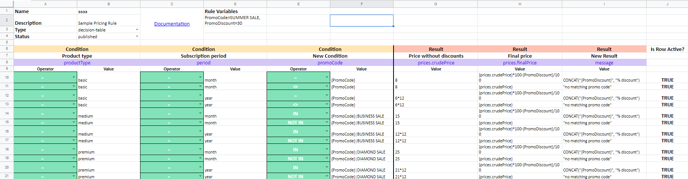

# Import & Export Decision Table

## How to Import or Export Decision Table in DecisionRules

#### Export & Import Decision Table in native JSON format


[export-decision-table.md](export-decision-table.md)



[import-decision-table.md](import-decision-table.md)


#### Export & Import Decision Table in XLSX


[export-decision-table-xlsx.md](export-decision-table-xlsx.md)



[import-decision-table-xlsx.md](import-decision-table-xlsx.md)


#### Export & Import Decision Table in CSV format


[export-decision-table-to-csv.md](export-decision-table-to-csv.md)



[import-decision-table-from-csv.md](import-decision-table-from-csv.md)


## File Structure of JSON format

Imported & Exported files need to have some mandatory structural information:

* **name:** name of the decision table
* **description:** description of the decision table
* **type:** type of the decision table
* **status:** [status of the decision table](broken-reference/)
* **inputSchema:** input schema of the decision table
* **outputSchema:** output schema of the decision table
* **decisionTable:** rules of the decision table


Type: there are two types:

* "**decision-table**" - for decision tables
* "**complex-rule**" - for scripting rules


#### Minimal File Structure Example:

```javascript
{
    "name": "",
    "description": "",
    "type": "",
    "status": "",
    "inputSchema": {
    },
    "outputSchema": {
    },
    "decisionTable": {
        "columns": [
        ],
        "rows": [
        ]
    }
}
```

#### File Structure Example:

```javascript
{
    "name": "Sample rule",
    "description": "Sample package delivery rule",
    "type": "decision-table",
    "status": "published",
    "inputSchema": {
        "delivery": {
            "distance": {},
            "tariff": {}
        },
        "package": {
            "weight": {},
            "longestSide": {}
        }
    },
    "outputSchema": {
        "price": {}
    },
    "decisionTable": {
        "columns": [
            {
                "condition": {
                    "type": "simple",
                    "inputVariable": "delivery.tariff",
                    "name": "Delivery tariff"
                },
                "columnId": "6849dfec-7621-93af-1e40-21c60bccafe0",
                "type": "input"
            },
            {
                "columnOutput": {
                    "type": "simple",
                    "outputVariable": "price",
                    "name": "Delivery Price"
                },
                "columnId": "d88e08fc-b179-7ce7-5567-7ebd06c6e9d1",
                "type": "output"
            }
        ],
        "rows": [
            {
                "cells": [
                    {
                        "column": "6849dfec-7621-93af-1e40-21c60bccafe0",
                        "scalarCondition": {
                            "value": "basic",
                            "operator": "="
                        },
                        "type": "input"
                    },
                    {
                        "column": "d88e08fc-b179-7ce7-5567-7ebd06c6e9d1",
                        "outputScalarValue": {
                            "value": "150"
                        },
                        "type": "output"
                    }
                ]
            }
        ]
    }
}
```

## File Structure of XLSX format


More information in [Manage Decision Tables in Excel/Google Sheets](../manage-tables-excel-gsheets.md)


Imported & Exported files need to have some mandatory structural information:

* **name:** name of the decision table
* **description:** description of the decision table
* **type:** type of the decision table
* **status:** [status of the decision table](broken-reference/)
* **decisionTable:** rules of the decision table

#### File Structure Example:




## File structure of CSV format

Creating CSV file by hand is **not recommended** because of uncluttered structure that big CSV files have. Then there is a lot of room for error. It is recommended to use Excel or Google Sheets to edit exported CSV files.


More info about managing decision tables in Excel or Google Sheets [here](../manage-tables-excel-gsheets.md).

