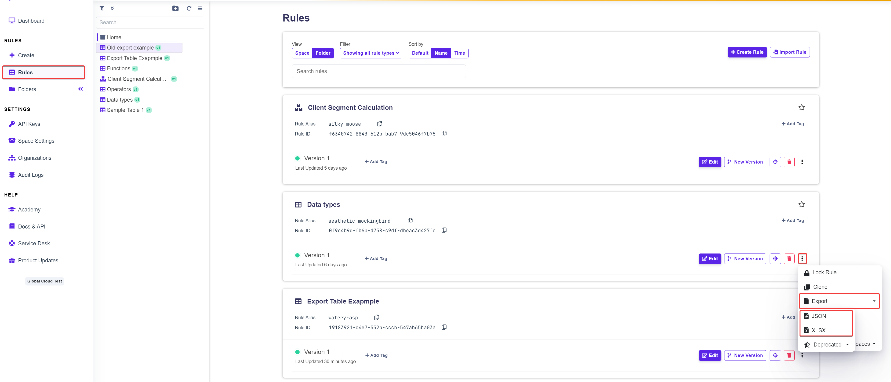

# Export Decision Table

## Exporting a Rule

You can export the decision table into various formats, including JSON, XLSX, or deprecated formats like XLSX v.1 and CSV.


We strongly recommend using the updated XLSX format instead of the deprecated XLSX v.1 and CSV, as the older versions lack newer functionalities.


There are three ways to export a decision table in DecisionRules

### Folders Sidemenu

* Right-click the rule you want to export.
* Click **Export** and choose the export type you need.

<figure><figcaption>
Export in the folders menu
</figcaption></figure>

### Rules Section of DecisionRules

* In the sidebar, navigate to **Rules**.
* Click the three dots in the bottom-right corner of the rule tile.
* Select **Export** and choose the export type you need.

<figure><figcaption>
Export in the Rules section
</figcaption></figure>

### Rules Settings

* Navigate to the specific rule and enter its settings.
* Click **Export** in the top-right corner and select the desired export type.

<figure><figcaption>
Export in the rule settings
</figcaption></figure>
