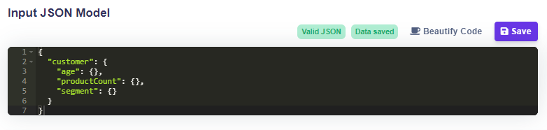
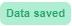
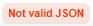

# JSON Editor

## Working with the JSON Editor



### Applying changes

1. For every changes applied, there is a need to save them.
2. If the model is changed,  is changed to .
3. Then it is important to click on  button where it is showing .


All the changes are made to the current table version.



There are no limitations in creating Input/Output model. A model can have unlimited root objects and unlimited children.


### Creating a Model

The Model has the same structure as a tree and should be written in JSON format. There are root objects that contain children, but only leaf objects (objects without children) can be selected as variables.

#### There is only one option on how to create a leaf object:

* Object with empty **{}**: `"object": {}`


Arrays and values are not allowed.


#### Example of a simple model with leaves only:

```javascript
{
    "distance": {},
    "tariff": {},
    "weight": {},
    "longestSide": {}
}
```

#### Example of a complex model:

```javascript
{
  "delivery": {
    "distance": {
      "car": {},
      "ship": {},
      "plane": {}
    },
    "tariff": {}
  },
  "package": {
    "weight": {},
    "longestSide": {}
  }
}
```

### Beautify Code

The button  will change your written code to a better readable format.


This functionality is especially useful when **copying and pasting** JSON from another source or window on your device.


### Valid JSON format

If the text has a valid JSON format,  is shown, otherwise,  is shown. The text has to be modified to a valid format before saving.
