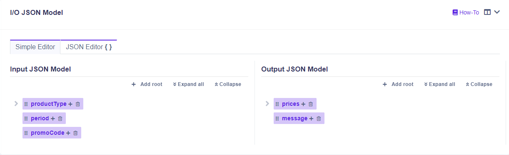

# Simple Editor

## Working with the input & output model editor


After making any changes to the input/output model, please make sure to save it by clicking the save button in the bottom right corner.



All the changes are made only to the current rule version.



There are no limitations in creating input/output model. A model can have unlimited number of root objects and children.


### Adding a Root object

To create a root object, click on .png>) button.

### Adding a Child object

To create a child object, click on **+** sign on the parent object.

### Moving an Object to another Parent object (Dragging)

To move an object to another parent object or make it a child, drag the selected object and drop it on the parent object.

To make a child object as parent object, drag the selected child object and drop it on the same level as the parent object.

### Showing Children Objects

To show children objects, click on.png>) next to the parent object.

### Deleting an Object

To delete an object, click on .png>) button on the object.

### Showing all structure

To show all structure and all object, click on .png>) button.

### Showing only Parent objects

To show only parent object, click on .png>) button.

### Renaming an Object

To rename an object, click on the **name** of the object. After that, an input is shown. When you are done making the changes, you can click anywhere outside the input box and the input box will disappear.
