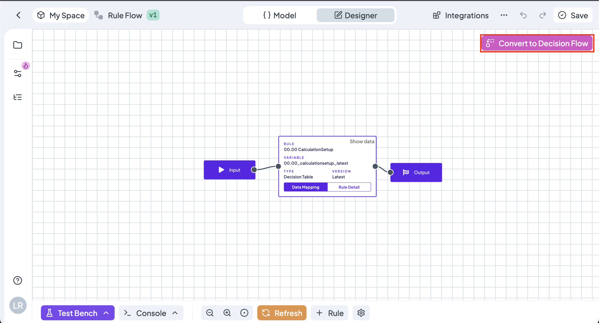

# Manage Decision Tables

## Creating a New Decision Table

### 1. Go to Decision Tables' page

To create a decision table, sign in, then go to **Decision Tables** item in the sidebar menu.

### **2.** Click on  button

The button creates new decision table with a new **Rule Id** and sets the **version to 1.** The new decision table has a **predefined sample structure** for better understanding.

