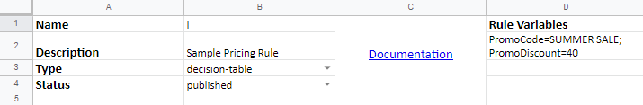
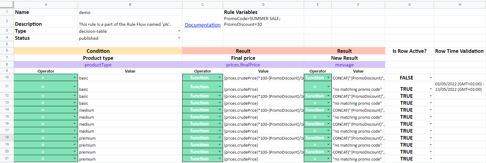

# Manage Decision Tables in Excel / Google Sheets

## How to manage Decision Tables outside the app

There is a way to manage your decision tables outside DecisionRules application. The reason for editing in Excel or Google Sheets is to make it easier, faster and clearer.


We recommend you to use Microsoft Excel or Google Sheets, which can work with **XLSX** format, other format such as ODT or simple XLS are not compatible.


There are two options to make your decision tables in XLSX format:

1. You can create your own XLSX file from scratch, which has to be in the exact format [**shown here.**](import-and-export-rule/#file-structure-of-xlsx-format)\*\*\*\*
2. Set the basic table in DecisionRules as we have in the [guide ](../tutorials/create-simple-decison-table.md)and [export](import-and-export-rule/export-decision-table-xlsx.md) the table to start to edit.


We recommend you the second option.


#### Exported table view

This is a barebones table with only one row to see what is going on here.

The table above shows how does the rule look like right after the export.

Now we will break down the table into smaller pieces with an explanation.

### Header

The header consists of 4 basic elements:

 (1).png>)

* **Name:** the name of the table
  * text format
  * can be changed
  * import as a new table - this name is set
  * import to existing table - name from XLSX file is not changing the name
* **Description:** text, you can write here anything that appears in the table settings
* **Type:** the only supported type is **decision-table**
* **Status:** [more information](broken-reference/)
  * you have to choose - pending/published

### Rule Variables

If the rows contain any rule variables, it is important to either add them to the excel or after you import the decision table into our app. If you export a decision table from our app, the rule variables will be automatically added.

* &#x20;If you choose to add them in the excel file, you have to add them to the cell D2. The rule variables are name=value pairs with equal sign in between them. The rule variables have to be separated by semicolons except for the last variable. See cell D2 to see the example.


Commas and double quote marks will most likely cause trouble, so please try to avoid it.

If you really need to use them, use these codes that will be converted in our app.

Instead of comma, write %2C

Instead of double quote mark, write %22


### Row Activity

Row activity column is responsible for activating/deactivating row once it is imported back to our app.

* For older decision tables that don't have the 'Is Row Active?' column, it is necessary to add this exact text to the 6th row, right next to the last Result. The text inside the cell has to be exactly 'Is Row Active?'.
* Decision tables newly exported already have this column prepopulated with the values that align with the activity status in our app.&#x20;
* Only two allowed values for the activity status is either TRUE or FALSE.
* To see an example, look at the penultimate column of the decision table below.&#x20;

### Row Time Validation

Row time validation column is responsible for adding time validation to particular rows.

* For older decision tables that don't have the 'Row Time Validation' column, it is necessary to add this exact text to the 6th row, right after the row activity column. The text inside the cell has to be exactly 'Row Time Validation'.
* One of the forms the date can have looks like such:

 (2).png>)


Please note that the format can have also other forms depending on which time properties you want to validate. Best option is to add the time validation inside DecisionRules at least to one row, so that you know how it should look like.


* If the row doesn't have a time validation then simply leave the cell empty.
* To see an example, look at the last column of the decision table below.


CSV Caveat:

If you edit the decision table inside a CSV file, there are two possible scenarios...

1. Some of the rows have a date validation and others don't, in that case add the validation to the rows where it should be and to the rows that don't have date validation, simply put a comma there and leave it empty.
2. None of the rows have a date validation. If that is the case, you can simply remove the "Row Time Activity" value and not add anything to the rows.


### Table

The table consists of two basic parts:

* CONDITION - input (yellow)
* RESULT - output (red)

Every condition and result is a column in a table with its properties such as input/output model, column, operator and value.

### **CONDITION**

We will describe what does each line in the table means in the following example.

.png>)

Every condition is made of 2 columns.

* **Condition -** it has to be over both columns, it indicates the input (always the same)
* **Product Count -** the name of the column in the decision table
* **productCount -** input model attribute
  * **depositSum.usd** - input model attribute with embedded attribute
* **Operator** - dropdown to choose from the operator list (the header is always the same)
* **Value** - the values by themselves (the header is always the same)

### **RESULT**

.png>)

* **Result -** it indicates the output (always the same)
* **Client Segment -** the name of the column in the decision table
* **client.segment -** output model attribute with embedded attribute
  * **profitability** - output model attribute
* **Value** - the values by themselves (the header is always the same)

### Final notes


In MS Excel or Google Sheets, you can add rows, columns, attributes, values and choose operators. The changes will be imported to Table Editor.


All the changes made in MS Excel or Google Sheets will be validated upon the import back to DecisionRules, in case of nonconformity the tool will notify the user to make sure all the details are correct and they can be imported.


To add rows or columns the easiest way is to duplicate them from the table, then to change the properties.

