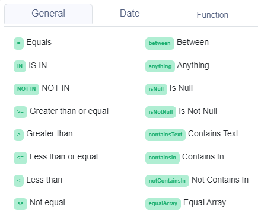

# Operators

## Operators in Decision Tables

Every condition cell in the [decision table](../decision-table-designer.md) can have a different operator. There are two types of operators which you can use [**General**](general-operators.md)**,** [**Date**](date-operators.md) **or** [**Functions**](../functions/)**.**

### General operators

General operators can be used for basic decision rules where you need to use String, Number or Boolean.


List of [General operators](general-operators.md).


### Date operators

Operators of dates are specifically used for date comparison in ISO format.


List of [Date operators](date-operators.md).


### Functions

Functions are specifically used to create function validation.

.png>)


List of [Functions](../functions/).

