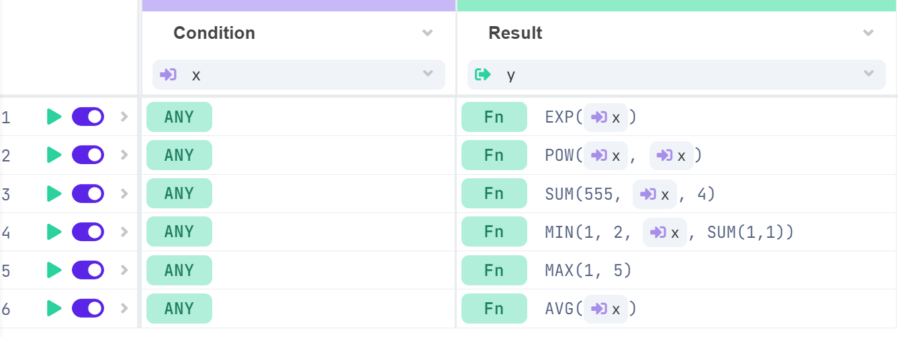

# Functions

DecisionRules functions are essential for building decision processes of any complexity. These functions can be applied in different rule types, such as [Decision Tables](broken-reference), [Decision Trees](broken-reference) and [Workflows](broken-reference), allowing users to write mathematical and logical expressions in both conditions and results

<figure><figcaption><p>How functions can be used in a decision table</p></figcaption></figure>

## Categories of Functions

Functions are divided into several categories based on their area of application:

* **Math functions**
* **Logical functions**
* **Date and time functions**
* **Text functions**
* **Data functions**
* **Array functions**
* **Integration functions**

## General Usage and Principles

Though the functions have broad applications and behaviors, they share several core principles. These apply universally across all functions. Below is a quick overview, supported by basic examples.

### Syntax

The syntax for DecisionRules functions is simple. Functions are written using their names (always uppercase, occasionally containing underscores) followed by parentheses that enclose the function arguments, separated by commas.

```javascript
SUM(1,4,5)  --> 10
```

Each function accepts a variable number of arguments, some optional, while others do not need any arguments at all.

Example of no-argument function:

```javascript
NOW()   --> returns the current date and time
```


In Decision Tables, functions can be used in condition, result, and calculation columns.

* **Condition columns**: You can choose the function from the operators modal, which opens when you click the operator badge. Functions in these columns must evaluate to boolean values (true or false).
* **Calculation and result columns**: These do not have the operators modal. Simply start typing the function name, and a dropdown whisper will appear, showing all matching functions.


### Values

DecisionRules supports several data types:

* **Primitive types**: number, string, boolean, null.
* **Complex types**: arrays, objects.
* **Additional types for functions**: date, regular expressions.


Read more in the [Supported Data Types](../../data-types.md) section.


Basic syntax examples:

```json
12.1          --> number
"abc"         --> string
true          --> boolean
false         --> boolean
null          --> null
```


As shown above, strings are typically enclosed in double quotes. For simple string expressions that do not contain special characters \[\*/+-(),%{}], the quotes can be omitted. However, we recommend keeping them for clarity and consistency.


Special characters within strings can be handled with either single quotes or escape sequences:

```json
"abcd"        --> abcd
'ab"cd'       --> ab"cd
"ab\"cd"      --> ab"cd
"ab\'cd"      --> ab'cd
"ab'cd"       --> ab'cd
"ab\\cd"      --> ab\cd
```

#### Type Conversion

Functions in DecisionRules often handle type casting automatically. If possible, they will convert values to the required type.

```json
SUM(1,4,"5")    --> 10
```

However, type casting does not always work. If values cannot be converted, the function will either fail validation or return an error at runtime.

```json
SUM(1,4,"abc")    --> invalid
```

#### Arrays and Objects

Some functions accept arrays or objects as arguments. DecisionRules uses JSON-like syntax for arrays and objects.

```json
SUM([1,4,5])    --> 10
```

```json
[1,4,5]                     --> array of numbers
[{"id":"A5B52","price":45}] --> array of objects
{"id":"A5B52","price":45}   --> object with key-value pairs
```

#### Nesting Functions

Functions can be nested inside each other. For instance, one function's result can be passed as an argument to another function.

```json
SUM(MAX(1,2),1)    --> 3
```

Here, `MAX(1,2)` evaluates to `2`, which is then used in the `SUM` function.

#### Variables

There are five types of variables that can be used in functions:

* **Input variables**: represent the rule's input data.
* **Output variables**: represent the rule's output data.
* **Rule variables**: user-defined variables with rule-level scope.
* **Calculation column variables**: variables declared in calculation columns in Decision Tables.
* **Abstract function variables**: special variables used in certain functions.

Variables are referenced using curly brackets (`{}`).

```javascript
// number = 3

SUM({number},6)   --> 9
```

In cases where the value from the variable cannot be used, the evaluation will fail and return an empty value:

<pre class="language-javascript"><code class="lang-javascript"><strong>// number = "a"
</strong>
SUM({number},6)   --> null
</code></pre>

#### Functions in Decision Tables

In Decision Tables, functions can be used in condition, result, and calculation columns.

* **Result columns** can contain any type of function.
* **Condition columns** must evaluate to boolean values (true or false).
* **Calculation columns** allow users to define variables or intermediary values that can be used in other columns for more complex calculations.

<figure><figcaption><p>Example of functions in the condition and calculation columns</p></figcaption></figure>

When using functions in a decision table, you can turn on the Debug Mode and open the Console to see the detail of how they evaluated.
