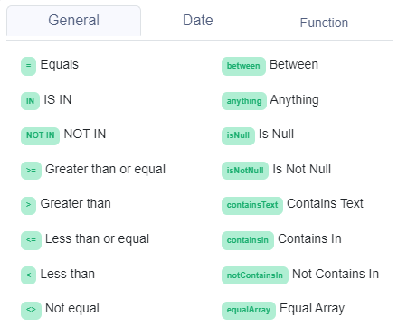

# General operators

## List of general operators

Every condition cell in the [decision table](../decision-table-designer.md) can have a different operator. These are the general operators which you can choose from:



## Anything Operator (anything)

The anything operator (anything) returns  `true` always.

## Equals Operator (=)

Compares two scalar values. The equal operator compares mainly:

* String
* Number
* Boolean

#### Equal Operator examples:

```javascript
[request value] = [table value]
3 = 3             //true
"3" = "3"         //true
"3" = 3           //false
true = true       //true
```

## IS IN Operator (IN)

The IS IN operator ( **** `in` ) returns `true` if the right operand contains the left operand, and `false` otherwise.&#x20;

* Members of the set can be separated by **pipe** (|), **comma** (,), **semicolon** (;)
* The right operand has to be **** an **array `[]`**
* The input string value is **not converted** from string to number
* Only exact matches!

#### IS IN Operator examples:

```javascript
[request value] IN [table value]
3 IN [1, 2, 3]            //true
4 IN [1, 2, 3]            //false
"a" IN ["a", "b", "c"]    //true
"d" IN ["a", "b", "c"]    //false
"3" IN [1, 2, 3]          //false
3 IN ["1", "2", "3"]      //false
[3] IN ["1", "2", "3"]    //false
```

## NOT IN Operator (NOT IN)

The NOT IN operator ( **** `not in` ) returns `true` if the right operand does not contain the left operand, and `false` otherwise.&#x20;

* Members of the set can be separated by **pipe** (|), **comma** (,), **semicolon** (;)
* The right operand has to be **** an **array `[]`**
* The input string value is **not converted** from string to number

#### NOT IN Operator examples:

```javascript
[request value] NOT IN [table value]
3 NOT IN [1, 2, 3]            //false
4 NOT IN [1, 2, 3]            //true
"a" NOT IN ["a", "b", "c"]    //false
"d" NOT IN ["a", "b", "c"]    //true
"3" NOT IN [1, 2, 3]          //true
3 NOT IN ["1", "2", "3"]      //true
[3] IN ["1", "2", "3"]        //true
```

## Greater than OR Equal Operator (>=)

The greater than or equal operator (`>=`) returns `true` if the left operand is greater than or equal to the right operand, and `false` otherwise.

* Numbers can be decimal or integer
* The input string value is **not converted** from string to number
  * String comparison is [similar to JS](https://developer.mozilla.org/en-US/docs/Web/JavaScript/Reference/Operators/Greater\_than\_or\_equal)

#### Greater than OR Equal Operator examples:

```javascript
[request value] >= [table value]
5 >= 3              // true
3.1 >= 2.1          // true
"b" >= "a"          // true
"a" >= "a"          //true
true >= true        // true
true >= false       // true
```

## Greater Operator (>)

The greater operator (`>`) returns `true` if the left operand is greater than the right operand, and `false` otherwise.

* Numbers can be decimal or integer
* The input string value is **not converted** from string to number
  * String comparison is [similar to JS](https://developer.mozilla.org/en-US/docs/Web/JavaScript/Reference/Operators/Greater\_than)

#### Greater Operator examples:

```javascript
[request value] > [table value]
5 > 3              // true
3.1 > 2.1          // true
"b" > "a"          // true
true > true        // false
true > false       // true

```

## Less than OR Equal Operator (<=)

The less than or equal operator (`<=`) returns `true` if the left operand is less than or equal to the right operand, and `false` otherwise.

* Numbers can be decimal or integer
* The input string value is **not converted** from string to number
  * String comparison is [similar to JS](https://developer.mozilla.org/en-US/docs/Web/JavaScript/Reference/Operators/Less\_than\_or\_equal)

#### Less than OR Equal Operator examples:

```javascript
[request value] <= [table value]
3 <= 5              // true
3 <= 3              // true
2.1 <= 3.1          // true
"a" <= "a"          // true
"a" <= "b"          // true
true <= true        // true
false <= true       // true

```

## Less than Operator (<)

The less than operator (`<`) returns `true` if the left operand is less than the right operand, and `false` otherwise.

* Numbers can be decimal or integer
* The input string value is **not converted** from string to number
  * String comparison is [similar to JS](https://developer.mozilla.org/en-US/docs/Web/JavaScript/Reference/Operators/Less\_than).&#x20;

#### Less than Operator examples:

```javascript
[request value] < [table value]
3 < 5              // true
2.1 < 3.1          // true
"a" < "b"          // true
true < true        // false
false < true       // true
```

## **Between** Operator (between)

The between operator (`between`) returns `true` if the left operand is between or equal to the right operand, and `false` otherwise.

* The left operand can be Number, String, or Boolean
* The right operand has to be String

#### Between Operator examples:

```javascript
[request value] between [table value]
4 between [3 and 5]                // true
3 between [3 and 5]                // true
4.0 between [3.0 and 5.5]          // true
3.5 between [3.0 and 5.5]          // true
"b" between ["a" and "c"]          // true
"a" between ["a" and "c"]          // true
true between [true and false]      // true
true between [true and true]       // true
```

## Not Equal Operator (<>)

Compares two scalar values. The not equal operator compares mainly:

* String
* Number
* Boolean

#### Not Equal Operator examples:

```javascript
[request value] <> [table value]
3 <> 3             //false
"3" <> "3"         //false
"3" <> 3           //true
true <> false      //true
```

## Is Null

The is null operator (IsNull) returns true if the value is empty.

```javascript
[request value] <> [table value]
                   //true
"a"                //false
3                  //false
""                 //false
```

## Is Not Null

The is not null operator (IsNotNull) returns true if the value is not empty.

```javascript
[request value] <> [table value]
"a"                //true
3                  //true
""                 //true
                   //false
```

## Contains Text Operator (containsText)

The contains text operator (`containsText`) returns `true` if the left operand contains in the right operand, and `false` otherwise.

* Members of the set can be separated by **pipe** (|), **comma** (,), **semicolon** (;)
* The left operand can be Number, String, or Boolean
* The right operand has to be **String**
* It is matching not only the exact matches.

#### Contains Text Operator examples:

```javascript
[request value] containsText [table value]
"This is example 1,2,3 with true." containsText "1,2,3"        //true
"This is example false or true." containsText "true or false"  //true
"true or false" containsText ["true or false", "haha"]         //true
"true or falseEEE" containsText ["true or false", "haha"]      //true
"This is example true with false." containsText true           //false
"This is example 1 with true." containsText "test",2           //false
```

## Contains In Operator (containsIn)

The contains in operator (`containsIn`) returns `true` if the left operand is in the right operand, and `false` otherwise.

* Members of the set can be separated by **pipe** (|), **comma** (,), **semicolon** (;)
* The left operand can be Number, String, or Boolean
* The right operand has to be String
* Not only exact matches, can be entered as array\[]

#### Contains in Operator examples:

```javascript
[request value] containsIn [table value]
"This is example 1 with true." containsIn 1|2|3          //true
"This is example 1 with true." containsIn "1"|true|"ok"  //true
"This is example 1 with true." containsIn "is"|2|true    //true
"This is example 1 with true." containsIn true|3         //true
[1,2,3] containsIn true|3                                //true
["true or falseee", "haha"] containsIn true|false        //true
"This is example 1 with true." containsIn "test"|2       //false
```

## Not Contains In Operator (notContainsIn)

The not contains in operator (`notContainsIn`) returns `true` if the left operand  is not in the right operand, and `false` otherwise.

* Members of the set can be separated by **pipe** (|), **comma** (,), **semicolon** (;)
* The left operand can be Number, String, or Boolean
* The right operand has to be String

#### Contains Text Operator examples:

```javascript
[request value] notContainsIn [table value]
"This is example 1 with true." notContainsIn 2|3|4          //true
"This is example 1 with true." notContainsIn "2"|false|"ok" //true
"This is example 1 with true." notContainsIn "are"|2|false  //true
"This is example 1 with true." notContainsIn false|3        //true
[1,2,3] containsIn true|3                                   //false
["true or falseee", "haha"] containsIn "hello"|"bye"        //true
"This is example 1 with true." notContainsIn "test"|1       //false
```

## Equal Array Operator (equalArray)

The Equal Array operator ( **** equalArray ) returns `true` if the right operand does not contain the left operand, and `false` otherwise.&#x20;

* Members of the set can be separated by **pipe** (|), **comma** (,), **semicolon** (;)
* The left operand has to be **** an **array `[]`**
* The input string value is **not converted** from string to number

#### equalArray Operator examples:

```javascript
[request value] equalArray [table value]
[1, 2, 3]     equalArray  1|2|3      //true
["a", "b"]    equalArray  a|b        //true
[a, b]        equalArray  a|b        //false
[1,2,3]       equalArray  1|2        //false
[1, "false"]  equalArray  1|false    //true
```

