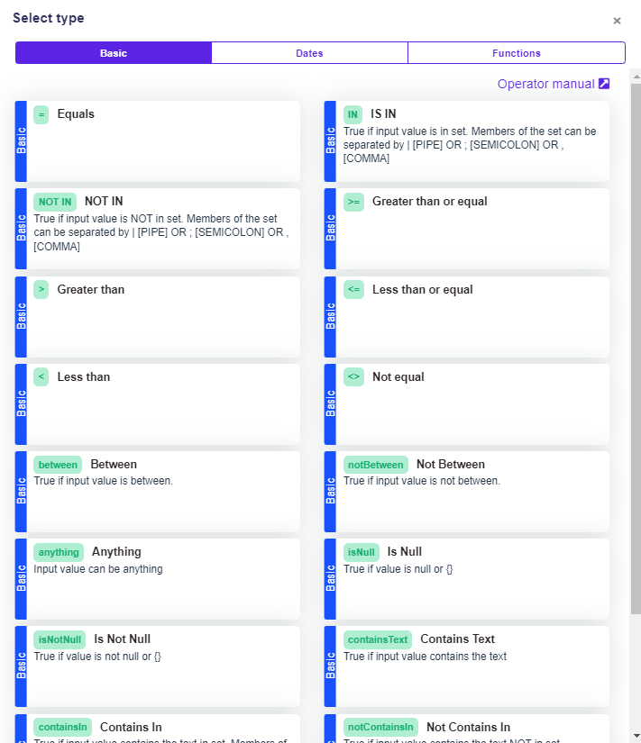

# General operators

## List of general operators

Every condition cell in the [decision table](../decision-table-designer.md) can have a different operator. These are the general operators which you can choose from:




All the input values (left operands) are auto-casted (meaning the value will be converted to the data type needed by the operator, whenever possible).



ALL THE RIGHT SIDE OPERANDS ARE ALSO AUTOCASTED.

THUS NO QUOTEMARKS SHOULD BE USED IN THE TABLE VALUES.

We use the double quote marks in the table values only to highlight the fact that these will be converted to string on the backend.&#x20;


### Anything Operator (anything)

The anything operator (anything) returns `true` always.

### Equals Operator (=)

Compares two scalar values. The equal operator compares mainly:

* String
* Number
* Boolean

#### Equal Operator examples:

```javascript
[request value] = [table value]
3 = 3             //true
"3" = 3           //true
true = true       //true
"true" = true     //true
```

### IS IN Operator (IN)

The IS IN operator ( `in` ) returns `true` if the right operand contains the left operand, and `false` otherwise.

* Members of the set can be separated by **pipe** (|), **comma** (,), **semicolon** (;)
* The right operand has to be an **array `[]`**
* Only exact matches!

#### IS IN Operator examples:

```javascript
[request value] IN [table value]
3 IN 1|2|3                //true
4 IN 1|2|3                //false
"a" IN "a"|"b"|"c"        //true
"d" IN "a"|"b"|"c"        //false
"3" IN 1|2|3              //true
```

### NOT IN Operator (NOT IN)

The NOT IN operator (`not in` ) returns `true` if the right operand does not contain the left operand, and `false` otherwise.

* Members of the set can be separated by **pipe** (|), **comma** (,), **semicolon** (;)
* The right operand has to be an **array `[]`**

#### NOT IN Operator examples:

```javascript
[request value] NOT IN [table value]
3 NOT IN 1|2|3                //false
4 NOT IN 1|2|3                //true
"a" NOT IN "a"|"b"|"c"        //false
"d" NOT IN "a"|"b"|"c"        //true
"3" NOT IN 1|2|3              //false
```

### Greater than OR Equal Operator (>=)

The greater than or equal operator (`>=`) returns `true` if the left operand is greater than or equal to the right operand, and `false` otherwise.

* Numbers can be decimal or integer
* String comparison is [similar to JS](https://developer.mozilla.org/en-US/docs/Web/JavaScript/Reference/Operators/Greater\_than\_or\_equal)

#### Greater than OR Equal Operator examples:

```javascript
[request value] >= [table value]
5 >= 3              // true
3.1 >= 2.1          // true
"b" >= "a"          // true
"a" >= "a"          // true
true >= true        // true
true >= false       // true
```

### Greater Operator (>)

The greater operator (`>`) returns `true` if the left operand is greater than the right operand, and `false` otherwise.

* Numbers can be decimal or integer
* String comparison is [similar to JS](https://developer.mozilla.org/en-US/docs/Web/JavaScript/Reference/Operators/Greater\_than)

#### Greater Operator examples:

```javascript
[request value] > [table value]
5 > 3              // true
3.1 > 2.1          // true
"b" > "a"          // true
true > true        // false
true > false       // true
```

### Less than OR Equal Operator (<=)

The less than or equal operator (`<=`) returns `true` if the left operand is less than or equal to the right operand, and `false` otherwise.

* Numbers can be decimal or integer
* String comparison is [similar to JS](https://developer.mozilla.org/en-US/docs/Web/JavaScript/Reference/Operators/Less\_than\_or\_equal)

#### Less than OR Equal Operator examples:

```javascript
[request value] <= [table value]
3 <= 5              // true
3 <= 3              // true
2.1 <= 3.1          // true
"a" <= "a"          // true
"a" <= "b"          // true
true <= true        // true
false <= true       // true
```

### Less than Operator (<)

The less than operator (`<`) returns `true` if the left operand is less than the right operand, and `false` otherwise.

* Numbers can be decimal or integer
* String comparison is [similar to JS](https://developer.mozilla.org/en-US/docs/Web/JavaScript/Reference/Operators/Less\_than).

#### Less than Operator examples:

```javascript
[request value] < [table value]
3 < 5              // true
2.1 < 3.1          // true
"a" < "b"          // true
true < true        // false
false < true       // true
```

### **Between** Operator (between)

The between operator (`between`) returns `true` if the left operand is between or equal to the right operand, and `false` otherwise.

* The left operand can be Number, String, or Boolean
* The right operand has to be an Array of two values

#### Between Operator examples:

```javascript
[request value] between [table value]
4 between [3 and 5]                // true
3 between [3 and 5]                // true
4.0 between [3.0 and 5.5]          // true
3.5 between [3.0 and 5.5]          // true
"b" between ["a" and "c"]          // true
"a" between ["a" and "c"]          // true
true between [true and false]      // true
true between [true and true]       // true
```

### Between Left Open Operator

The between left open operator (`betweenLeftOpen`) returns `true` if the request value falls between the interval excluding the lower limit (left value) and including the upper limit (right value). Otherwise it returns false.

* The left operand can be Number, String, or Boolean
* The right operand has to be an Array of two values

```
[request value] between [table value]
4 between [3 and 5]                // true
3 between [3 and 5]                // false
5.5 between [3.0 and 5.5]          // true
3.0 between [3.0 and 5.5]          // false
"b" between ["a" and "c"]          // true
"a" between ["a" and "c"]          // false
true between [false and true]      // true
false between [false and true]     // false
```

### Between Right Open Operator

The between right open operator (`betweenRightOpen`) returns `true` if the request value falls between the interval including the lower limit (left value) and excluding the upper limit (right value). Otherwise it returns false.

* The left operand can be Number, String, or Boolean
* The right operand has to be an Array of two values

```
[request value] between [table value]
4 between [3 and 5]                // true
5 between [3 and 5]                // false
3.0 between [3.0 and 5.5]          // true
5.5 between [3.0 and 5.5]          // false
"b" between ["a" and "c"]          // true
"c" between ["a" and "c"]          // false
true between [false and true]      // false
false between [false and true]     // true
```


####

### Not Equal Operator (<>)

Compares two scalar values. The not equal operator compares mainly:

* String
* Number
* Boolean

#### Not Equal Operator examples:

```javascript
[request value] <> [table value]
3 <> 3             //false
"3" <> 3           //false
3 <> 4             //true
true <> false      //true
```

### Is Null

The is null operator (IsNull) returns true if the value is empty.

```javascript
[request value] isNull [table value]
null               //true
{}                 //true
[]                 //true
"a"                //false
3                  //false
""                 //false
```

### Is Not Null

The is not null operator (isNotNull) returns true if the value is not empty.

```javascript
[request value] isNotNull [table value]
"a"                //true
3                  //true
""                 //true
null               //false
{}                 //false
[]                 //false
```

### Contains Text Operator (containsText)

The contains text operator (`containsText`) returns `true` if the left operand contains in the right operand, and `false` otherwise.

* Members of the set can be separated by **pipe** (|), **comma** (,), **semicolon** (;)
* The left operand can be Number, String, or Boolean or Array of these data types
* It is matching not only the exact matches but also the substrings

#### Contains Text Operator examples:

```javascript
[request value] containsText [table value]
[1,2,3] containsText "1"                                       //true
[11,2,3] containsText "1"                                      //true
[2,3,4] containsText "1"                                       //false
"This is example 1,2,3 with true." containsText "1,2,3"        //true
"This is example false or true." containsText "true or false"  //false
"This is example true with false." containsText true           //true
```

### Contains In Operator (containsIn)

The contains in operator (`containsIn`) returns `true` if any of the elements in the right operand is included in the element/elements of the left operand. Otherwise `false` is returned.


* `true` is returned when any of the elements in the right operand is included in any substring of the left operand.
* Members of the set can be separated by **pipe** (|), **comma** (,), **semicolon** (;)
* The left operand can be Number, String, Boolean or Array of these data types

#### Contains in Operator examples:

```javascript
[request value] containsIn [table value]
"This is example 1 with true." containsIn 1|2|3          //true
"This is example 1 with true." containsIn 1|true|"ok"    //true
"This is example 1 with true." containsIn "is"|2|true    //true
"This is example 1 with true." containsIn true|3         //true
[1,2,3] containsIn true|3                                //true
["true or falseee", "haha"] containsIn true|false        //true
"This is example 1 with true." containsIn "test"|2       //false
```

### Not Contains In Operator (notContainsIn)

The not contains in operator (`notContainsIn`) returns `true` if none of the elements in the right operand is included in the element/elements of the left operand. Otherwise `false` is returned.

* Members of the set can be separated by **pipe** (|), **comma** (,), **semicolon** (;)
* The left operand can be Number, String, Boolean or Array of these data types

#### Contains Text Operator examples:

```javascript
[request value] notContainsIn [table value]
"This is example 1 with true." notContainsIn 2|3|4          //true
"This is example 1 with true." notContainsIn 2|false|"ok"   //true
"This is example 1 with true." notContainsIn "are"|2|false  //true
"This is example 1 with true." notContainsIn false|3        //true
[1,2,3] containsIn true|3                                   //false
["true or falseee", "haha"] containsIn "hello"|"bye"        //true
"This is example 1 with true." notContainsIn "test"|1       //false
```

### Equal Array Operator (equalArray)

The Equal Array operator ( equalArray ) returns `true` if all the values inside the right operand are substrings of one of the values inside left operand.

* Members of the set can be separated by **pipe** (|), **comma** (,), **semicolon** (;)
* The left operand has to be an **array `[]`**

#### equalArray Operator examples:

```javascript
[request value] equalArray [table value]
[1, 2, 3]     equalArray  1|2|3      //true
["a", "b"]    equalArray  "a"|"b"    //true
[1,2,3]       equalArray  1|2        //true
[1111,111]    equalArray  1|11|111   //true
[1,2,3,4,5]   equalArray  1|2|3|4|6  //false
```

### Else Operator (ELSE)

The ELSE is a special kind of operator, whose returned value is **independent** of the respective input variable of the column. Instead, the ELSE operator returns `true` if no row has passed up to the time of evaluation of the condition cell.


Note that by definition, there can always be at most one passing row containing the ELSE operator.


The ELSE operator allows you, among other things, to add a so-called **default row** to your decision table. It is simply a row at the end of the table with ELSE operator in all of its condition cells. By definition, the default row gets triggered whenever there is no other row passing. It can be used e.g. to send an error message to the output.

