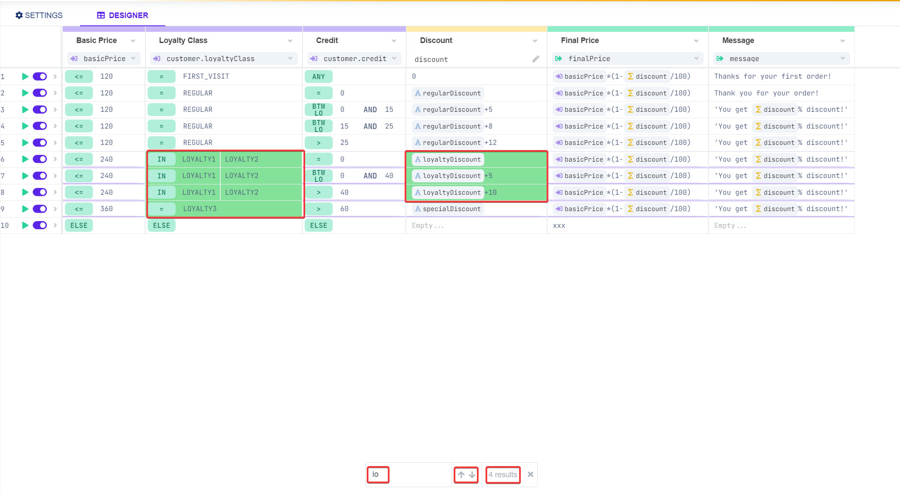

# Search and filter

Parameters in the decision tables can be filtered based on the filter properties or specific values can be searched.

### Filter

The icon of filter   on the right-hand corner under each condition or result allows you to filter the table based on the values you enter into the filter.

#### Example

Let's filter the first column all the values including 18 and profitability 1.

The matching lines are filtered out.

You can also filter by the partial part of a parameter, like in the example above. In the result client.segment we want to filter out all the clients that their segment contains aff. We do it like aff\*, star \(\*\) is used for this purpose.

### Search

Search can be found in the bottom bar.

By clicking on  , the search bar will appear where you can enter the values you want to find in the table.

The lines containing the specific values entered in the search will be highlighted with green color and the filed containing the exact values with darker green like on a picture above.

