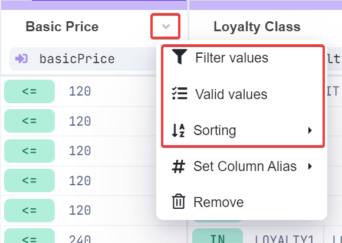

# Table Operations

## Kinds of Table Operations

Managing decision tables that contain thousands of rows and hundreds of columns can be challenging, especially when you need to locate and edit specific values. To enhance usability and streamline your workflow, we've implemented several powerful features designed to simplify navigation and editing. These operations, including filtering, sorting, and defining valid values, allow you to quickly focus on relevant data, ensuring a more efficient and organized approach to managing your decision tables. With these tools at your disposal, you can easily manipulate and refine your data, making the overall experience more intuitive and productive.

You can access these options by clicking the arrow icon in a column header:


[filter.md](filter.md)



[valid-values.md](valid-values.md)



[sort.md](sort.md)



For more information on additional context menu options and table manipulations, please refer to the [Table Designer](../decision-table-designer.md#column-operations-and-settings) section.

