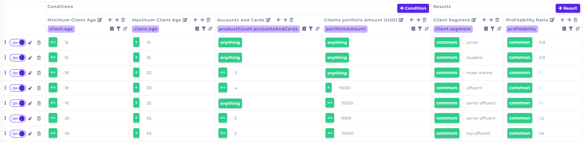
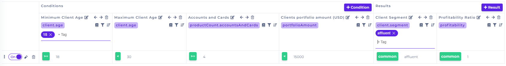
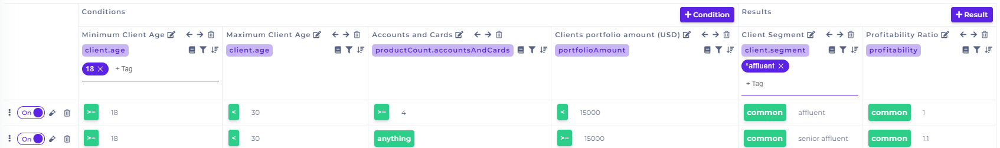

# Filter Values

## Filter Values in Decision Table

The icon of the filter is on the right-hand corner under each condition or result. It allows you to filter the table based on the values you enter into the filter.


At the same time, you can have active filters for more columns.


#### Example

Let's show how the filter works on a real rule

Set filter of the first **condition** column to "18" and first **result** column to "affluent"

The result is the only line here matching the filter. If we want all results containing the word affluent, we have to use "**\*affluent**"


Star (\*) before or after the word/value does take all the characters as matching.

**Example:** hello8, hello9 --> filter **hel\*** will return all the values

