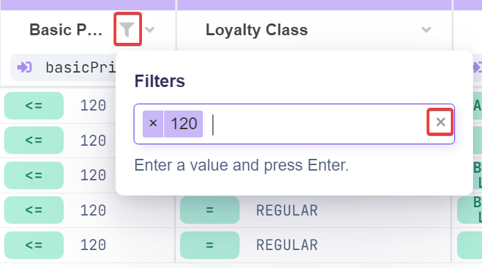

# Filter Values

## Filter Values in Decision Table

Filtering values in a decision table allows you to narrow down rows based on the values in a particular column. This is especially useful when working with large datasets.


Filtering is **case-insensitive** and supports **partial matches**. For example, if you filter by "2", it will match values like "120", "240", and "2+4".


## How to Apply Filters

<figure><figcaption></figcaption></figure>

1. **Access Filters**: Click the arrow icon in the header of the column you want to filter, then select **Filter Values**.
2. **Set Filter Expressions**:\
   A filter input field will appear where you can add one or more filter expressions. Simply type your expression and press **Enter** to apply it.
   * To remove a filter, click the cross icon next to the expression.
3. **Confirm Filters**:\
   Once your filters are set, confirm them by either clicking outside the filter modal or pressing the **Esc** key.

<figure><figcaption></figcaption></figure>

## Managing Filters

* You can apply filters to multiple columns simultaneously.
* When a column has an active filter, a filter icon will appear in the column header. Clicking this icon will reopen the filter input.
* To clear all filters, click the cross icon at the end of the filter input field.

<figure><figcaption></figcaption></figure>
