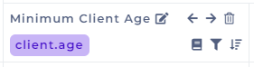
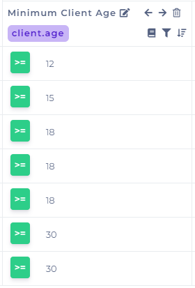
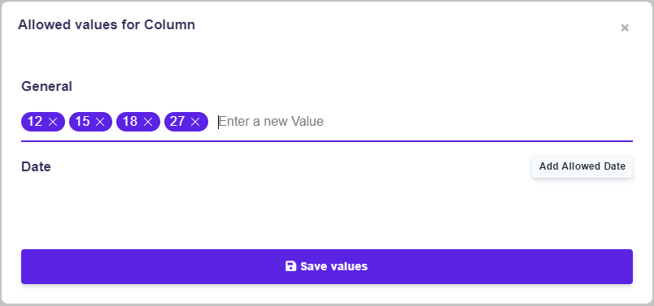
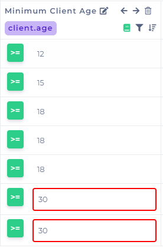
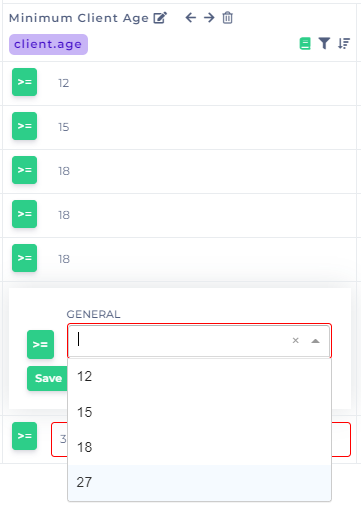

# Preset Values

## Preset Values in Decision Table

The icon of allowed the values.PNG>)is on the right-hand corner under each condition or result, it allows you to create the sets of the allowed values in the columns.

#### Example

Let's show how preset values works

By clicking on .PNG>) , the window will appear where you can enter the values you want to appear in between the allowed values. Add numbers 12, 15, 18, and 27 then save it.

Once you saved the values, you will see that the values in the cells that do not match have, hence they hence a red border. The icon will turn green, which indicates you are using preset values for the particular column.


If you already had values in the columns before making presets, all your cells will have red borders, so you need to choose values from the ones you made as preset or so include these values in preset/allowed.


By adding rows or columns into your rule, you have to choose values from the preset ones. You are no longer allowed to add custom values directly into cells, you have to do it in the way shown above.

