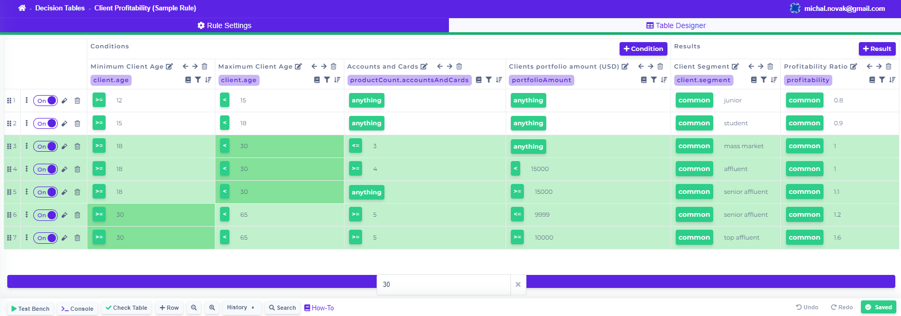

# Search

The search button can be found in the bottom bar

By clicking on  , the search bar will appear where you can enter the values you want to find in the table.

The lines containing the specific values entered in the search bar will be highlighted with green and the cells containing the specific values with darker green, like in the picture above.

