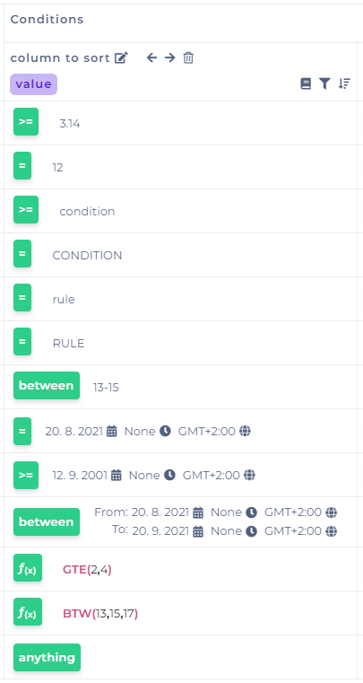
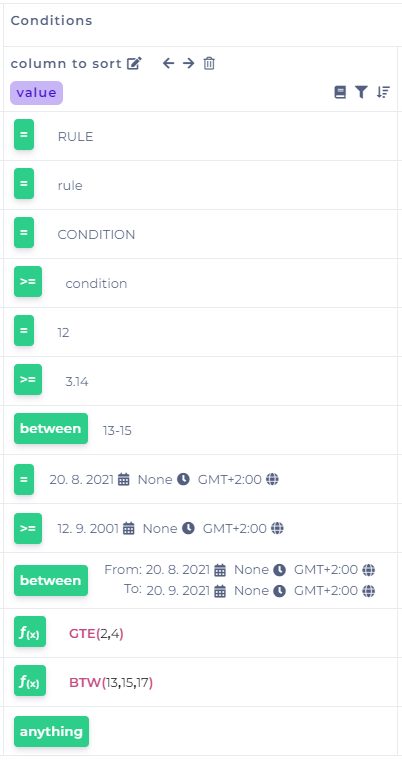

# Sort Values

## Sort Values in Decision Table

The icon of the sort is on the right-hand corner under each condition or result it allows you to sort the values in the tables in ascending or descending by the column.

### Sorting conditions

Ascending sorting is governed by:

1. numbers (0-9)
2. text (aA-zZ)
3. numbers fields (e.g. BETWEEN)
4. dates
5. date fields (e.q. BETWEEN)
6. functions
7. value "anything"

Descending sorting is governed:

1. text (Zz-Aa)
2. numbers(9-0)
3. numbers fields (e.g. BETWEEN)
4. dates
5. date fields (e.q. BETWEEN)
6. functions
7. value "anything"

