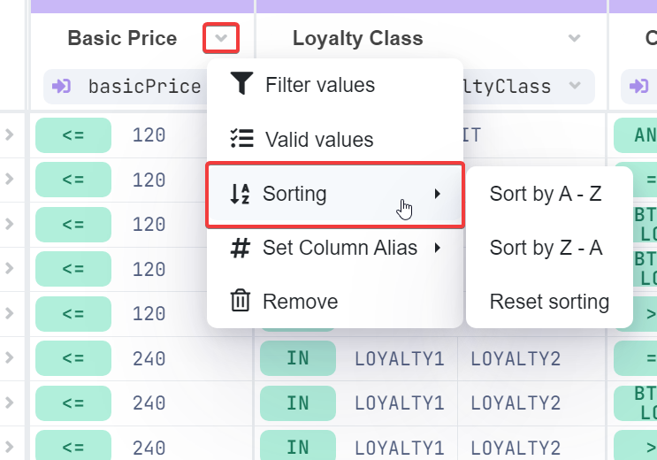

# Sorting

## Sort Values in Decision Tables

The sorting feature helps you rearrange the rows of your table in either ascending or descending order based on the values in a specific column.

## How to Apply Sorting

<figure><figcaption></figcaption></figure>

1. **Access Sorting**: Click the arrow icon in the header of the column you want to sort, then select **Sorting**.
2. **Choose Sort Order**:
   * **Sort by A-Z** (ascending)
   * **Sort by Z-A** (descending)

## Managing Sorting

* Only one column can be sorted at a time. Applying sorting to another column will reset the sorting of the previous one.
* When a column is actively sorted, a sorting icon will appear in the column header.
* To change the sorting direction, click the arrow icon in the column header, select **Sorting**, and choose the desired order.
* To remove sorting, click the arrow icon in the header, select **Sorting**, and choose **Reset sorting**.

<figure><figcaption></figcaption></figure>

## Sorting Rules

When a column contains multiple data types, sorting follows specific rules. Here’s how DecisionRules handles sorting:

### Descending Order

1. **Text**: Zz-Aa
2. **Numbers**: 9-0
3. **Operator**: `ELSE`
4. **Number fields**: (e.g., `BTW`)
5. **Dates**
6. **Date fields**: (e.g., `BTW`)
7. **Functions**
8. **Operator**: `ANY`

### Ascending Order

1. **Operator**: `ELSE`
2. **Numbers**: 0-9
3. **Text**: aA-zZ
4. **Number fields**: (e.g., `BTW`)
5. **Dates**
6. **Date fields**: (e.g., `BTW`)
7. **Functions**
8. **Operator**: `ANY`

<figure><figcaption>
Example of Sort by A-Z option
</figcaption></figure>

 

<figure><figcaption>
Example of Sort by Z-A option
</figcaption></figure>

