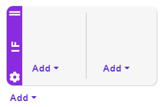
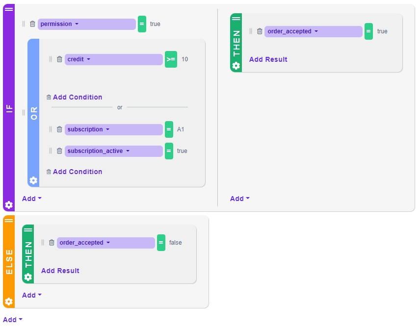

# Decision Tree Designer

Decision Tree Designer is the interface for building Decision Trees. In this section, we describe how you can easily create your Decision Tree, link it to the input and output data and deploy it.

.jpg>)

#### Applying changes

For any changes to be applied, there is a need to save them by clicking thebutton.

## About the Decision Tree Designer

When you open the Decision Tree Designer with an empty tree (by creating a new Decision Tree in the Decision Trees section and choosing Empty Decision Tree), you will see the initial empty screen. Create first condition by clicking the respective button. A new **IF block** will be added.

.jpg>)

### The IF Block

Every IF block consists of 2 parts. The left-hand part holds the conditions that have to be met in order for the right-hand part to take action.

You can add conditions by clicking the Add button in the left-hand part of the block. By default, all conditions have logical **AND** between them. That is, if you add two conditions, the right-hand part of the IF block will activate if and only if both of them are satisfied. However, you can add the OR block. The OR block contains so-called OR groups which have logical **OR** between them. They are visually separated by a line with the word 'or' in the middle (see below). The OR block is evaluated as true whenever at least one of its OR groups is evaluated as true.

#### Example

To understand the above concept faster, see the following example. We provide our IF block with several conditions. Let us explore the conditions upon which the right-hand part of the block (empty for now) will take action.

Suppose that we require <mark style="color:purple;background-color:purple;">**permission**</mark> to equal true AND one (or both) of the following conditions to be satisfied: (a) <mark style="color:purple;background-color:purple;">**credit**</mark> is greater than 10 OR (b) <mark style="color:purple;background-color:purple;">**subscription**</mark> has value A1 AND <mark style="color:purple;background-color:purple;">**subscription\_active**</mark> is true.

For those who prefer logical pseudo-language: `permission = true AND (credit >= 10 OR (subscription = A1 AND subscription_active = true))`

This collection of conditions can be represented in our IF Block simply as follows.

.jpg>)


Note that, in order to be able to work with input properties like <mark style="color:purple;background-color:purple;">**permission**</mark> or  <mark style="color:purple;background-color:purple;">**credit**</mark>, these have to be set up in the [Input/Output Model](../decision-tables/input-and-output/) in Rule Settings.


#### Manage OR groups

The OR groups can be easily managed. One can add OR groups by clicking the settings icon of the OR block and selecting Add OR group. On the other hand, OR groups can be removed by clicking the trash can icon at the bottom left corner of the OR group that you want to remove.


Note that the conditions inside an OR group implicitly have logical AND between them!


#### The right-hand side of the IF block

The right-hand side of the if block is triggered whenever the condition in the left-hand side is satisfied. It can hold two kinds of blocks: another IF blocks or THEN blocks. The IF blocks simply further branch out your Decision Tree. More interesting are the THEN blocks, which will be activated every time the conditions of their parent IF block are satisfied.

### The THEN Block

The THEN block represents our results. When all the conditions leading to some THEN block are satisfied, the THEN block is triggered. The rule then returns the results specified within this THEN block.

#### Back to our example

Let us provide our simple example with some result. We click the Add button in the right-hand part of our IF block and select Then. This will add a THEN block. Inside we will set up the results that we want to output whenever the provided conditions are satisfied. In our case, we want to simply take a property called <mark style="color:purple;background-color:purple;">**order\_accepted**</mark> and set it to true.


Again,to add the <mark style="color:purple;background-color:purple;">**order\_accepted**</mark> as a result, we have to set up this property in the [Input/Output Model](../decision-tables/input-and-output/) in Rule Settings. Our final Input/Output model is depicted below.


.jpg>)

&#x20;Congratulations, your first Decision Tree (well, decision trunk) is complete!

### The ELSE Block

If you click the Add button in the right-hand part of any IF block or in the root (the one not contained in any block), you may select to add an ELSE block. This block will be triggered whenever none of the conditions of its preceding IF blocks is satisfied.

#### Back to our example

We can use the ELSE block in our example from above. In fact, it is very handy. By adding the ELSE block after our IF block, we can treat the case that the condition of the IF is not met. Here, we just add a THEN block where we set the <mark style="color:purple;background-color:purple;">**order\_accepted**</mark> property to false, because the order should not be accepted in this case.

#### The ELSE Block Behavior

As we said before, the ELSE block will be only triggered when no conditions in its preceding IF blocks are satisfied. In other words, the ELSE block will look for all IF blocks directly above it and check if at least one of them was triggered. If it was, the ELSE block is automatically skipped. If not, the logical structure inside the ELSE block will take action.


Currently, it is allowed to place the ELSE block anywhere, even if there are no IF blocks above them. When placed in this way, the ELSE block will be always triggered. However, such placement makes little to no sense, and is therefore not recommended.


### Branching

You can branch your Decision Tree to arbitrary extent. Branching is done by nesting IF blocks in the right-hand part of other IF or ELSE blocks. This creates the familiar tree structure. Moreover, blocks can be also placed next to each other.

#### Multiple blocks

When multiple IF, THEN or ELSE blocks are placed below each other, they are evaluated successively from top to bottom. Therefore, if we have several THEN blocks in the Decision Tree setting the same property, and all of them happen to take effect, the respective property is eventually overwritten by the THEN block which is placed at the **lowest** position in the Decision Tree.

