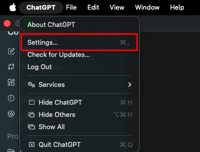
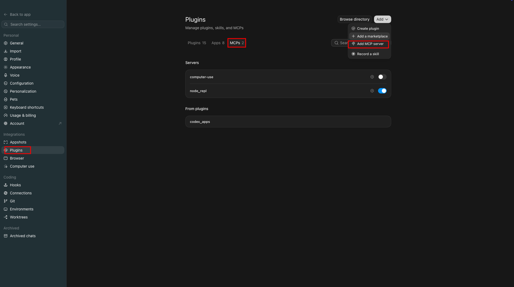
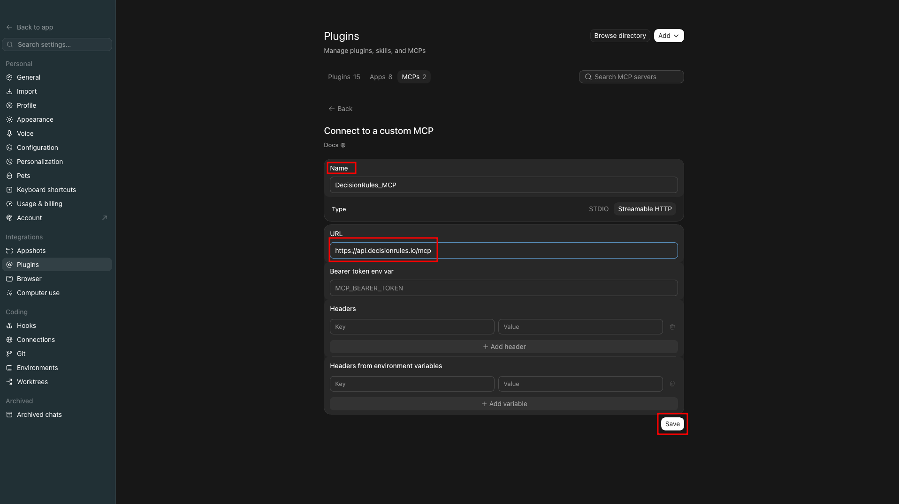
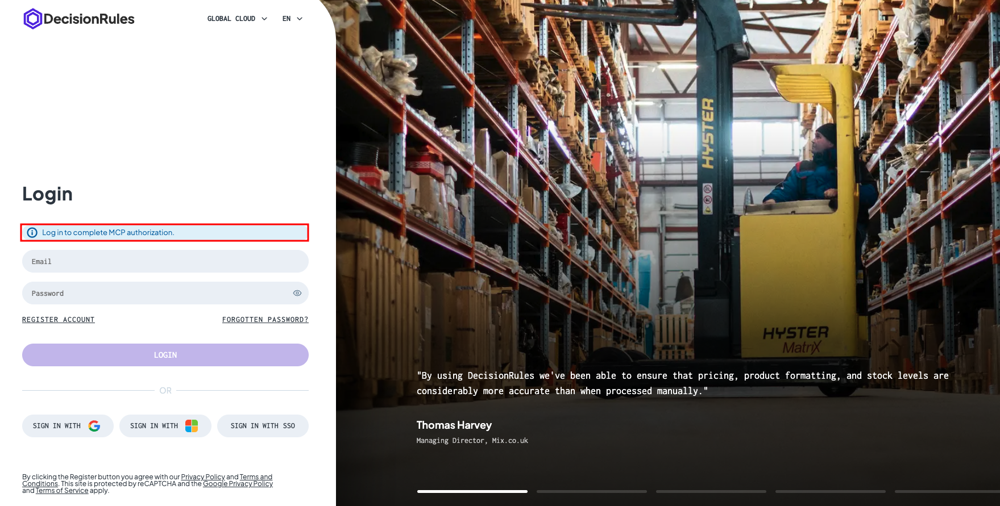
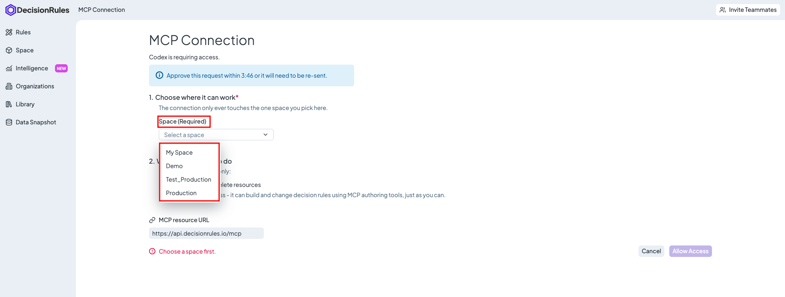
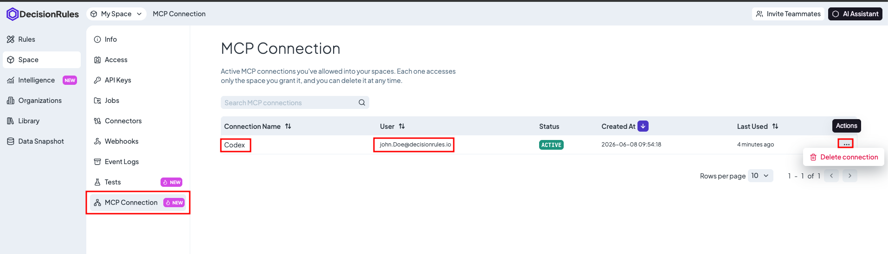

# Authoring MCP Server

## Authoring MCP Server

DecisionRules MCP Authoring Server gives MCP-compatible clients authenticated access to authoring, management, testing, execution, and AI-assisted generation capabilities in one selected DecisionRules space.

Use it when an AI assistant or automation needs to work with rules, Decision Flows, Rule Flows, folders, tags, tests, and related space operations.


**Full authoring access.** Grant **Connect MCP Server** only to trusted users. During OAuth approval, the connected client receives broad Management API access to the selected space. Its later actions are not limited by the connecting user's granular rule permissions.


### What Can It Do?

Depending on the DecisionRules version and available API keys, an MCP client can:

* Read, create, update, version, lock, organize, and delete rules
* Work with folders, tags, dependencies, Decision Flow resources, and Rule Flow packages
* List, create, update, move, import, and delete tests and test suites
* Solve an existing rule
* Generate Decision Table, Lookup Table, Scripting Rule, and Decision Flow proposals
* Propose a natural-language edit to an existing Decision Table, Scripting Rule, or Decision Flow
* Plan, refine, generate, recover, and import a complete multi-rule process
* Generate test-suite inputs for an exact Decision Table or Scripting Rule version


The focused AI rule, Decision Flow, process, and test-suite tools require DecisionRules App **1.26.2 or later** and AI Engine **1.3.0 or later**.


### Connect to the Authoring MCP Server

#### Prerequisites

Before connecting, make sure that:

* Your MCP client supports remote HTTP MCP servers.
* Your DecisionRules subscription includes Management API and MCP authoring.
* You have access to the space you want to connect.
* Your role has the **Connect MCP Server** permission.
* The space has a Management API key, or your role has **Create API Key** permission so one can be created during OAuth approval.
* The space has a Solver API key if you want to use `solve_rule` or import AI-generated test suites.
* A compatible AI Engine and provider are configured if you want to use AI-assisted tools.

#### Roles and Connection Permissions

The permission to connect an MCP client is separate from the permissions used to view or revoke existing connections.

| Role or access model     | Default behavior                                                               |
| ------------------------ | ------------------------------------------------------------------------------ |
| Private-space Admin      | Can connect MCP clients, view active connections, and revoke them.             |
| Editor                   | Can connect an MCP client but cannot open the MCP Connections management page. |
| Reader                   | Cannot connect MCP clients or manage connections.                              |
| Organization/custom role | Permissions must be added explicitly through the Space Role or policy.         |

For organization spaces, being an organization owner or administrator does not automatically grant MCP connection management in every space. The assigned Space Role or policy must include:

* **Connect MCP Server** to authorize and continue using an OAuth connection
* **View MCP Connections** to open the connection list
* **Delete MCP Connection** to revoke connections

For OAuth connections, DecisionRules rechecks the user's current **Connect MCP Server** permission when later Management and Solver tools are called. Removing this permission prevents subsequent tool use through that OAuth connection.


The current permission check controls whether the OAuth connection can still be used. It does not restrict individual MCP authoring actions to the user's granular rule permissions.


#### MCP Server URL

Use the URL for your DecisionRules environment:

| Environment       | MCP server URL                        |
| ----------------- | ------------------------------------- |
| Standard cloud    | `https://api.decisionrules.io/mcp`    |
| EU regional cloud | `https://eu.api.decisionrules.io/mcp` |
| US regional cloud | `https://us.api.decisionrules.io/mcp` |
| AU regional cloud | `https://au.api.decisionrules.io/mcp` |
| Self-hosted       | `<YOUR_API_URL>/mcp`                  |

### Connect with OAuth

OAuth is recommended for interactive MCP clients. The following example uses the ChatGPT/Codex app, but the same server can be connected from another remote-HTTP MCP client with OAuth support.



#### Add the Server

Add a remote MCP server in your client and enter the MCP URL for your environment.

<figure><figcaption><p>Add a custom remote MCP server.</p></figcaption></figure>

<figure><figcaption><p>Enter the Authoring MCP server details.</p></figcaption></figure>

<figure><figcaption><p>Save the server configuration.</p></figcaption></figure>





#### Sign In

Select **Authenticate**. The client opens DecisionRules in your browser. Sign in if required.

<figure><figcaption><p>Start OAuth authentication.</p></figcaption></figure>

<figure><figcaption><p>Sign in to DecisionRules when prompted.</p></figcaption></figure>



#### Choose a Space

Select the space the client may access. One connection can access only the selected space.

<figure><figcaption><p>Select the one space the connection may access.</p></figcaption></figure>



#### Review and Approve

Review the requested access and select **Allow Access**. If the space has no Management API key, approval creates one when you have **Create API Key** permission.



#### Return to the Client

After approval, you are redirected to a successful setup page. The MCP server is now available in the client. Some clients need to be restarted before newly connected tools appear.

The connection is also listed under **Space → MCP Connections** for users with **View MCP Connections** permission.

<figure><figcaption><p>The Authoring MCP server is ready in the client.</p></figcaption></figure>



### Connect with a Management API Key

Use a static key for clients that cannot complete OAuth or for controlled service integrations.

1. Open **Space → API Keys**.
2. Create or copy a **Management API** key.
3. Configure the MCP URL and send the key as a Bearer token.

For clients that accept an MCP JSON configuration, use the equivalent of:

```json
{
  "mcpServers": {
    "decisionrules": {
      "url": "https://api.decisionrules.io/mcp",
      "headers": {
        "Authorization": "Bearer <MANAGEMENT_API_KEY>"
      }
    }
  }
}
```


Treat a Management API key as a secret. It provides broad Management API access to its space. A connection using a static key is not listed under **Space → MCP Connections**.


### AI-Assisted Authoring Workflow

AI tools return reviewable proposals. Generation and persistence are separate operations.

#### Create One Rule or Decision Flow

Choose the matching generator:

| Desired proposal | Tool                      |
| ---------------- | ------------------------- |
| Decision Table   | `generate_decision_table` |
| Lookup Table     | `generate_lookup_table`   |
| Scripting Rule   | `generate_scripting_rule` |
| Decision Flow    | `generate_decision_flow`  |

Review a successful result before passing the complete resource unchanged to `create_rule`. Do not import a failed semantic-review result or manually reconstruct its internal payload.

Use Decision Tables as the default for declarative business policy. Use scripting only when the requirement needs a concrete procedural capability that declarative resources cannot provide.

#### Edit an Existing Rule or Decision Flow

Use `propose_rule_edit` with the existing resource identity and the natural-language instruction. The server loads the saved content and chooses the appropriate Decision Table, Scripting Rule, or Decision Flow editor.

After review:

* Use `update_rule_version` to update an unpublished version in place.
* Use `create_rule_version` to preserve the history of a published rule.

Pass the complete reviewed proposal unchanged. Do not save a corrected copy as a new base rule.

#### Build a Complete Process

A complete process has a reviewable lifecycle:

1. `plan_process` proposes the rules and flows.
2. Review the plan and explicitly choose any existing-rule reuse.
3. Use `refine_process` only when the plan needs a requested change.
4. `build_process` starts generation and returns a stable build ID.
5. `get_process_build` reports per-step progress.
6. Use `answer_process_question` or `retry_process_step` when the build reports the corresponding state. For a required split or repair, call `propose_process_step_replan`, review the localized replacement, and then call `accept_process_step_replan` after approval.
7. Call `import_process` only after the build is complete and the user approves the import.

Possible existing rules are never selected automatically. Show the candidate's exact alias, version, and status and obtain an explicit choice before adding reuse to the plan.

Generation does not persist rules. `import_process` is the only process-build tool that writes the generated folder to the space.

#### Generate and Import a Test Suite

Use `generate_test_suite` for one exact saved Decision Table or Scripting Rule version. It generates test scenarios and inputs, but intentionally leaves expected outputs empty.

After review, pass the proposal unchanged to `import_generated_test_suites`. DecisionRules solves the exact saved rule version to populate expected outputs before the suite is persisted.

### Available Tools and Limitations

The exact tools displayed by the MCP client depend on the DecisionRules Server version.

#### Available Capabilities

| Area                     | What the MCP client can do                                                           | Example tools                                                     |
| ------------------------ | ------------------------------------------------------------------------------------ | ----------------------------------------------------------------- |
| Rules and Decision Flows | Read, create, update, delete, version, lock, and change version status.              | `get_latest_rule`, `create_rule`, `update_rule_version`           |
| Folders                  | Read, create, rename, move, import, export, overwrite, and delete folder structures. | `get_folder_tree_by_path`, `create_folder`, `move_folder_nodes`   |
| Tags                     | Find items by tags and add or remove tags from resources and versions.               | `list_items_by_tags`, `add_tags_to_item`                          |
| Analysis                 | Read dependencies and find duplicate rows in Decision Tables.                        | `get_latest_rule_dependencies`, `find_latest_rule_duplicates`     |
| Rule Flows               | Import and export Rule Flow packages and versions.                                   | `import_rule_flow`, `export_rule_flow_version`                    |
| Tests                    | List and manage tests and test suites, including reviewed AI-generated suites.       | `list_test_suites`, `create_test`, `import_generated_test_suites` |
| Space                    | List space items and read owner usage statistics.                                    | `list_space_items`, `get_space_owner_statistics`                  |
| Solving                  | Execute an existing saved rule with input data.                                      | `solve_rule`                                                      |
| AI rule generation       | Generate Decision Table, Lookup Table, Scripting Rule, and Decision Flow proposals.  | `generate_decision_table`, `generate_decision_flow`               |
| AI rule editing          | Propose an update to an existing Decision Table, Scripting Rule, or Decision Flow.   | `propose_rule_edit`                                               |
| AI process authoring     | Plan, refine, build, resume, repair, and import a multi-rule process.                | `plan_process`, `get_process_build`, `import_process`             |
| AI test generation       | Generate inputs for a Decision Table or Scripting Rule test suite.                   | `generate_test_suite`                                             |

#### Important Limitations

* A connection is limited to one selected space.
* Grant authoring access only to trusted users and clients.
* Delete and overwrite tools can permanently change space resources.
* `solve_rule` and generated-test-suite import require a Solver API key.
* AI-assisted tools require a compatible AI Engine, a configured provider, and available AI usage.
* `generate_test_suite` supports Decision Tables and Scripting Rules, not Decision Flows.
* A generated Decision Flow is managed through the rule tools. Rule Flow authoring remains limited to the exposed Rule Flow import and export operations.
* Subscription limits, structure limits, validation rules, and endpoint restrictions still apply.
* This server does not search DecisionRules Documentation. Use the separate Documentation MCP server for documentation search.


Before allowing an AI client to perform a large or destructive change, ask it to list the planned operations and review the affected resource IDs, paths, aliases, and versions.


### Troubleshooting

| Problem                                                 | Resolution                                                                                                     |
| ------------------------------------------------------- | -------------------------------------------------------------------------------------------------------------- |
| Approval is disabled                                    | Ask for **Connect MCP Server** in the selected space.                                                          |
| An existing OAuth connection stopped working            | Confirm that the user still has **Connect MCP Server** and that the connection has not been revoked.           |
| A Management API key cannot be created                  | Create the key first, or ask for **Create API Key** permission.                                                |
| MCP tools are unavailable                               | Confirm that the subscription includes Management API and MCP authoring, then reconnect or refresh the client. |
| AI authoring tools fail or are missing                  | Confirm App and AI Engine compatibility, `AI_ENGINE_URL`, provider configuration, and AI usage availability.   |
| `solve_rule` or test-suite import reports a missing key | Create a Solver API key in the selected space.                                                                 |
| A process is still running                              | Continue polling its existing build ID. Do not start the same build again.                                     |
| The connection request expired                          | Start a new connection from the MCP client.                                                                    |
