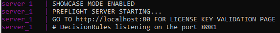

# Showcase Client/Server App


**Easy to start with** 


## How to start the SHOWCASE app

First of all, you need to download the docker-compose file.

You can download compose config with curl as shown below.

```text
curl https://decisionrules.io/showcase/docker-compose.yml --output docker-compose.yaml
```

Once you download our pre-configured compose file as is described in the tutorial on the landing page you have few options on how to get docker containers running.

* You don't have a license key
* You have a license key

**Before you start check if you meet the**[ ****](https://app.gitbook.com/@decisionrules/s/docs/~/drafts/-MjdvQSMZTu19By95CbQ/on-premise-docker/server-container-and)\*\*\*\*[**prerequisites**](server-container-and.md)**.**

### I do not have the license key

If you don't have the license key yet you can generate one on our [landing page](https://decisionrules.io/on-premise#license) in just a couple of minutes. You will receive an email with a license key.


License key lasts for 30 days from the moment of generation.


### Entering the license key with the validation site

After you obtain the license key you can open the terminal and navigate yourself to the folder where you downloaded the docker-compose file as shown in the step above.

Then run: 

```text
docker compose up
```

Docker will find a docker-compose file by itself and pull all mandatory containers and create all volumes defined in config. By default, you don't need to change anything. 

After that, you will see something like this in terminal



Now if you go to `localhost:80` you will be redirected to the validation page where you can enter your key and after that, you can register a new account to local mongo DB running in the Docker container.

 



Right after the successful validation showcase turned off and the DecisionRules server is started.


After that license key is stored in docker volume so there is no need to enter the license key again at the next start of the container \(in case of containers recreation you will be prompted again with the validation site\).


**After registration, you are ready to use DecisionRules for 30 days as you like.**


### Entering the license key into the docker-compose file.

If you don't want or can't use our validation page you can enter the license key directly into the configuration file.

The license key belongs to the`LICENSE_KEY`variable in your docker-compose file and save.

After that run command below in the folder containing the docker-compose file that you edited.

```text
docker compose up
```

After decisionrules/server comes alive and connects to local Redis and mongo DB, you should see something very similar to this:


After this, you can enter `localhost:80` and you will be redirected to the login page of the DecisionRules login screen.


**After registration, you are ready to use DecisionRules for 30 days as you like.**


