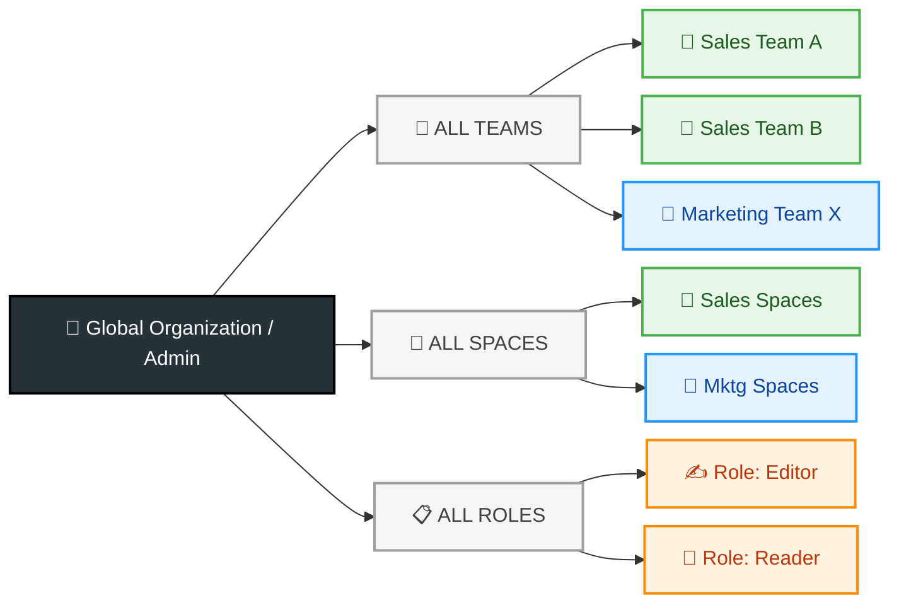
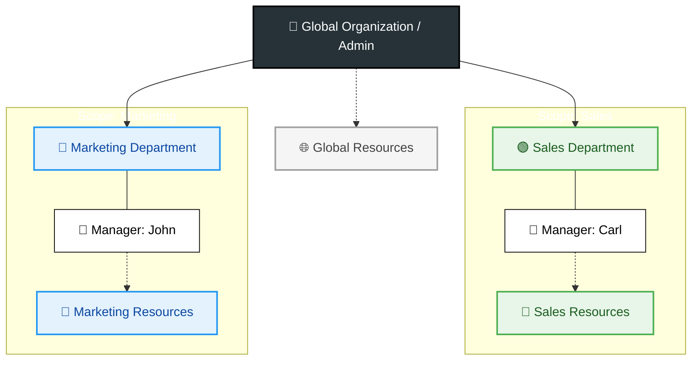
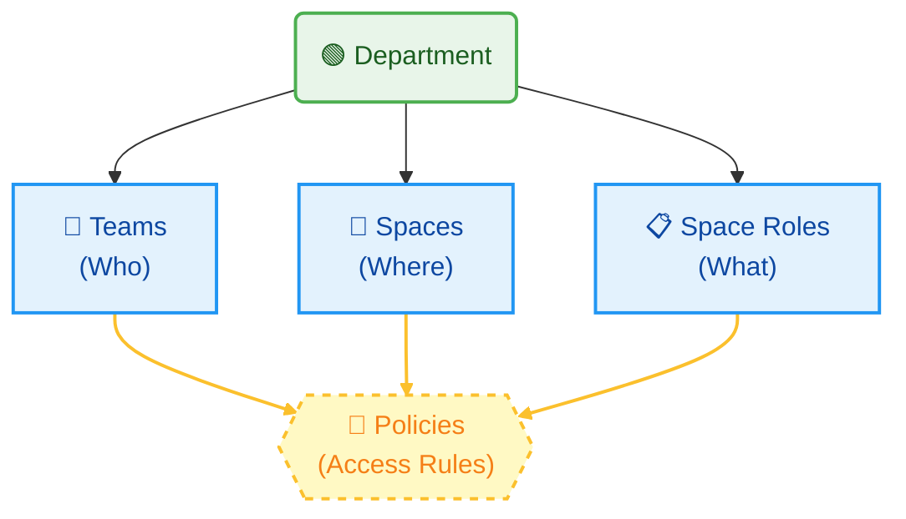

# Departments

### Quick Navigation

1. <mark style="background-color:$primary;">Understand Departments</mark>: Continue reading below for a high-level overview of how departments function within the organization.
2. <mark style="background-color:$primary;">Setup & Administration</mark>: If you are an Owner or Admin looking to create or configure organizational units, go to: [Setup Guide](setting-up-department.md).
3. <mark style="background-color:$primary;">Managing Your Department</mark>: If you are a Department Manager looking for instructions on day-to-day operations, go to: [Department Manager role](department-manager-guide.md).

### What are Departments?

A Department is a structural container within your organization. It isolates specific Teams, Spaces, and Space Roles so they can be managed independently from the rest of the organization by department managers. See following graph with example department structure.

#### Problem that Companies Faced before Departments:

#### The Solution:&#x20;

### The Organizational Benefit:

As illustrated above, this structure creates clean "Silos of Responsibility":

* Segmentation: Users and Teams are grouped logically. A "Sales" team lives strictly within the Sales Department.
* Scalability: You can add as many departments as needed without cluttering the global view.
* Clarity: It provides an immediate visual map of who belongs where, making it easy for Admins to audit the organization at a glance.
* Flexibility & Delegation: While Departments act as dedicated silos, they remain connected to the wider company. Admins retain ultimate control—you can manage a department directly, or appoint a Department Manager to offload the day-to-day work.


#### Manager Scope:&#x20;

Department Managers are restricted to managing only their assigned department. Detailed role limitations are covered here: [Setting up Department](setting-up-department.md#summary-of-delegation)






