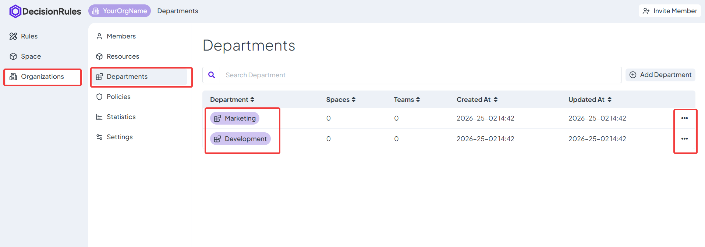
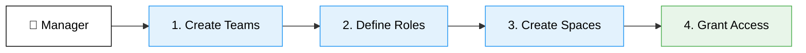
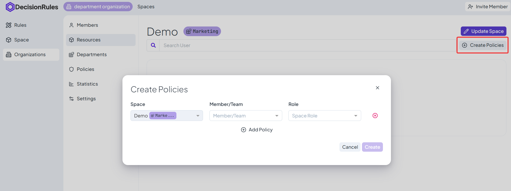

# Department Manager Guide

### Introduction

As a Department Manager, you hold the keys to your specific organizational unit. Your goal is to structure how work gets done without needing to ask the Global Admin for permission.

To begin managing your department:

1. Navigate: Go to Organizations in the sidebar.
2. Select Organization: Click the organization where you hold a manager role.
3. Enter Department: Open the Departments tab and click your department's name to launch the Department Detail view.

<figure><figcaption></figcaption></figure>


#### Can't find your Department?

If you are unsure which department you manage, navigate to Members > _your detail_ and switch to Departmens tab. There is a list of Departments you are member of.


### Step-by-Step Execution



#### Create Teams (Who)

Navigate to the **Teams** tab in Department Detail. You may not be able to invite _new_ people to the company (_if your role is Viewer_), but you have full control to invite everyone to the team from existing members.

Action: Click Add Team and complete the required fields.

_Notes:_&#x20;

* _The Department field is automatically pre-filled based on your current department branch._
* Organization-level teams can be added to your Spaces, but their membership is controlled solely by Organization Admins.

_For more details on team management, visit:_ [Teams](../resources/teams.md)



#### Define Roles (What)

Navigate to **Space Roles**. Before creating workspaces, you must define the "Rules of Engagement."

Click Add Role to configure specific permission levels for the department.

* Default Roles: The Editor and Viewer roles are included by default in every department branch.
* Customization: Use this action to create additional roles or modify existing access levels.

_Note:_&#x20;

* _Roles created here are reusable across all Spaces in your department. While you can also use Global Organization Roles, these are managed exclusively by Organization Admins and cannot be modified at the department level._

&#x20;_For more details on permissions, visit:_ [Space Roles](../resources/space-roles.md)



#### Create Spaces (Where)

Navigate to **Spaces**. These are the actual folders or project environments where the work happens.

Action: Create a Space for a specific project (e.g., "Q4 Campaign"). At this stage, the Space is empty and secure—no one has access yet.

&#x20;_For more details on workspace structure, visit:_ [Spaces](../resources/spaces.md)



#### Grant Access (The Result)

Simply creating Teams and Spaces does not automatically give anyone access. To let a team start working, you must explicitly grant access by creating a Space Policy.

* Action: Apply the "Access Equation" to connect your Team to your Space.
* The Rule: A Space remains locked until a Policy is created for it.

> <mark style="color:$success;">\[Space Name] + \[Team] + \[Role] = Access Granted</mark>



### Applying Space Policies

You can apply <mark style="color:$success;">this equation</mark> from two places in the application:

#### Local Scope (Direct)

Best for: Setting up a single new project.

1. Enter Department: Navigate to the Departments tab and click your department's name to open the Department Detail view.
2. Select Space: Switch to the Spaces tab and click on the specific Space name to enter the Space Detail view.
3. Initiate: Click the Create Policies button located in the top action bar.
4. Apply: Add your Teams and Roles to complete the setup.

<figure><figcaption></figcaption></figure>

#### Centralized Policies (Bulk)

Best for: Managing space policies across multiple projects at once.

1. Go to the main Policies menu on the left sidebar.
2. Select Space Policies.
3. Space Selection: Choose the target space from the dropdown.
4. Targeting: Assign specific Teams or Members to Roles.


#### Smart Filtering:

When selecting a Space, the system only displays Roles and Teams that are available within your Department or at the Global Organization level.


_For more details visit:_ [Policies](../policies.md)
