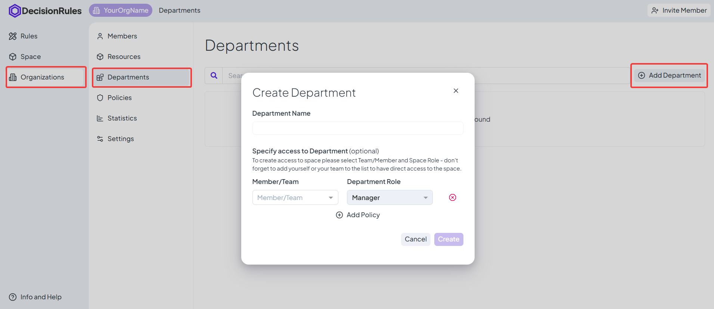
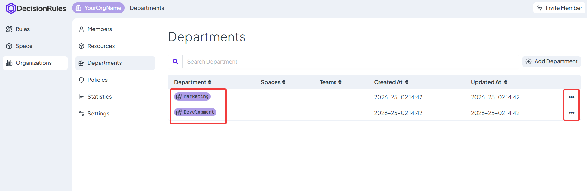
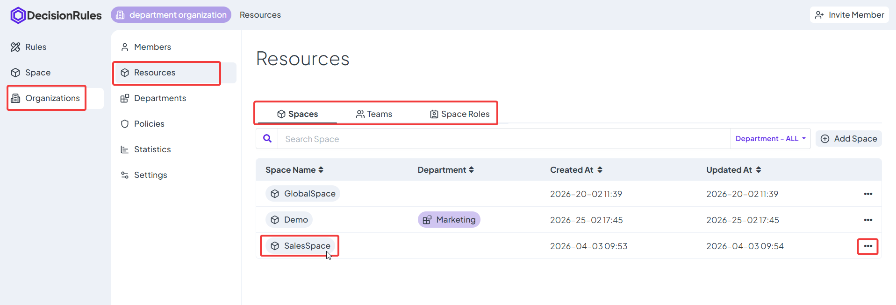
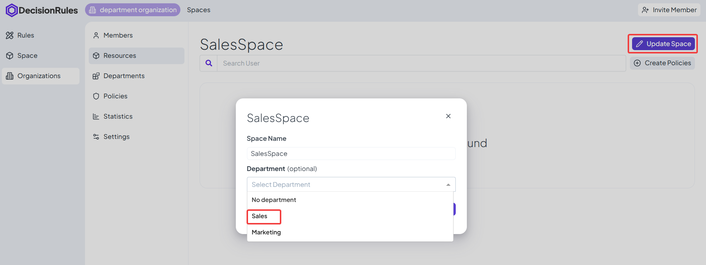
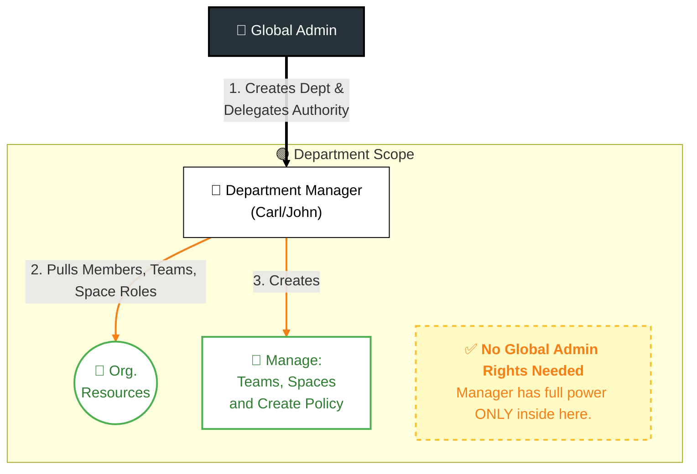

# Setting up Department

### Creating a Department

Step 1: Navigate From the left sidebar, select Organization.

Step 2: Select the organization intended for the new department.

Step 3: You will land on the _Members_ tab. Switch to the Departments tab. _(Note: If this is your first time, the list will say "No Departments found".)_

Step 4: Initiate Setup Click the Add Department button to launch the configuration modal.

Step 5: Configuration Settings

* Department Name: Enter a unique title (e.g., "Marketing", "legal"). _(Required)_
* Department Manager: You may immediately assign a Team or Member to manage this unit, or leave it blank to assign later. _(Optional)_

Step 6: Finalize Click Confirm to save the new entry.

<figure><figcaption></figcaption></figure>

Once created, click the department name (or the ... menu) to enter the Department view. This view mirrors the global layout but is strictly scoped to this specific department.

<figure><figcaption></figcaption></figure>

### Department Detail

The Department view mirrors the organization-level layout, featuring a specific Department Access tab.

* Navigation: Toggle between familiar tabs (Members, Teams, etc.) to manage department-specific data.
* Department Access: This tab is dedicated to Governance. Its only role is to view current managers or assign new ones.


#### **Key Concept: Scope & Isolation**&#x20;

Everything created inside this view stays inside.

* Teams created here belong _only_ to this Department.
* Members added here are associated _only_ with this branch.
* This ensures that your "Engineering" teams do not clutter the "Sales" views.


### Moving Org. Resources to Department

Now that your Department is created, it is currently an empty container. If you have been using the platform for a while, your Global Organization is likely already filled with active Teams, Spaces, and Space Roles.

Instead of creating everything from scratch, Global Admins can easily migrate existing global resources directly into a new Department. This is the crucial step to transition your workspace from a cluttered "Flat Organization" into a clean, scalable structure.

#### The Benefit of Migrating Resources:

Moving items into a Department is the key to delegating your workload. When you transfer a global Team, Space, or Space Role into a Department, you grant the assigned Department Manager the authority to handle its day-to-day operations.


#### Note on Admin Visibility:

Moving a resource does not hide it from you. Global Admins retain 100% visibility and ultimate control over everything inside every Department. You are simply sharing the management responsibilities.


#### How to Migrate a Resource:

To move an existing global resource into your new Department, follow these steps (It's same for every resource):

Step 1: Navigate to Organization Resources. Go to your main Organization view and open the tab of the resource you want to move (Teams, Spaces, or Space Roles).

Step 2: Select the item. Locate the specific Team, Space, or Role you wish to migrate and open its detail (_by clicking the item_ or its `...`).

<figure><figcaption></figcaption></figure>

Step 3: Click Update Space/Team/Roles.

Step 4: Assign the Department. Locate the Department field in the configuration modal.

Step 5: Save and Transfer. Select your newly created Department from the dropdown menu and click Update.

<figure><figcaption></figcaption></figure>

### Assigning Department Managers

To delegate authority, you must assign a Manager. You can do this from two locations:


#### Role Restriction

Only Viewers can be assigned as Department Managers. Admins and Owners already have global access. To get better understanding of organizations members read [Organization Introduction](../organization-introduction.md).


#### Local Assignment (Department Scope)

1. Navigate inside the specific Department.
2. Open the Department Access tab.
   1. Click Add Department Access.
3. Select the user (Viewers only) or team to assign as Manager.


#### Team Access

Assigned teams only grant management access to members holding the Viewer role. Members within the team remain restricted.


<figure><figcaption></figcaption></figure>

#### (Global) Policies Tab

Go to the -> Policies menu and select the Department Policies tab to manage assignments across the entire organization. For more info visit documentation about [Policies](../policies.md).

### Summary of Delegation

By completing the steps above, you have successfully moved the workload from the Global Admin to the Department Manager.

The assigned Manager now has the authority to:

* Manage Locally: Create and govern Teams, Spaces, and Space Roles strictly within their assigned department.
* Pull from Global: Invite existing individual members from the wider organization into their specific department's Teams or Spaces.
* Grant Access (Local & Global): Define who sees what inside their department. To do this, Managers can use the Teams and Space Roles they created locally, or they can leverage existing Global Teams and Global Space Roles to grant access.


#### Utilizing Global Resources:&#x20;

If a Manager uses a Global Team or Global Space Role to grant access to a departmental space, any modifications made to those global items by an Admin (e.g., changing the permissions of a Global Role, or adding users to a Global Team) will automatically take effect within the department as well.


