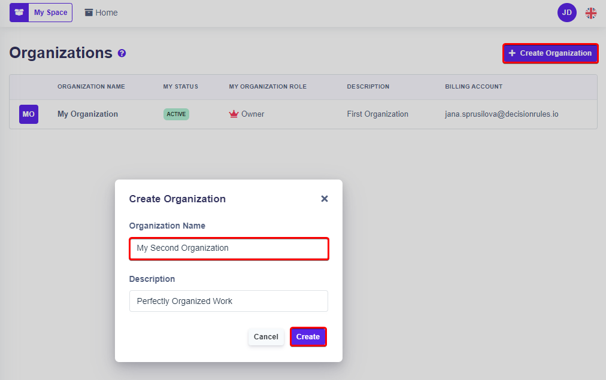

# Access to Organization

Organizations can be accessed from the Decision Rules side menu through the "Organizations" section. In the organization section you can create a new organization, also here you can find all your organizations and organizations in which you are a member.

Use the "**Create Organization**" button to display a window for entering the name of the new organization (required). By clicking&#x20;

<figure><figcaption>
Create Organization
</figcaption></figure>
