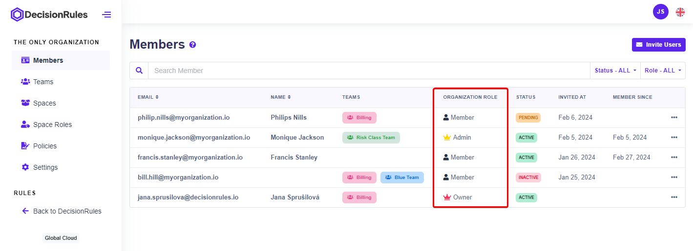

# Organization Introduction

The Organization feature empowers administrators, to orchestrate user privileges, define space permissions, and streamline collaboration seamlessly. While its primary function revolves around user and space management, Organization extends its capabilities to offer a comprehensive suite of functionalities tailored to meet diverse organizational needs. The **Organization** feature is included with certain plans, **r**ead more about plans [**here**](https://www.decisionrules.io/pricing/public-cloud).

### **Core Functionality**

* **User Management** - Enable administrators to create, read, update, and delete users and their roles in organization, ensuring straightforward user administration.
* **Team Management** - Simplifies administrator work by establishing teams comprising specific sets of users to define the roles and policies.
* **Space Management** - Keep governance for administrator to define spaces and roles configuration to keep permissions tailored in line with organizational requirements.
* **Policies Management -** Control for roles to designated users or teams within spaces, optimizing access rights and ensuring security.
* **Inviting Users** - Effortlessly invite users to the organization, facilitating seamless onboarding and collaboration.
* **Billing Account Integration** - Seamlessly connect billing accounts to manage financial transactions and subscriptions conveniently.
* **User Account Rights** - Customize user account privileges, restricting capabilities such as space creation, user invitation, role management, and API key access based on organizational policies.
* **Comprehensive Overview** - Provide administrators with comprehensive insights into account activities, API usage, rules enforcement, space utilization, invited users, and audit logs to ensure transparency and accountability.
* **Flexible Account Management** - Organization accounts are not tied to email addresses, offering the flexibility to change ownership as organizational stakeholders evolve.

### Organization Roles

Roles within an organization are pivotal for granting users the necessary permissions to carry out tasks aligned with their responsibilities. Two types of roles exist: organization roles and [space roles](space-roles.md).&#x20;

Organization roles are assigned when a user is invited to join an organization. By default, the user who initiates the organization becomes the Owner. Each user within an organization holds only one organization role. Owners and Admins have the capability to manage organization roles from the Members tab within Organization settings. The three primary organization roles are as follows:

* **Owner** - can manage everything at the organization level. There must **always** be at least one owner in an organization.
* **Admin** - can manage everything at the organization level except billing.
* **Member** - can only access spaces they are added to.

<figure><figcaption></figcaption></figure>
