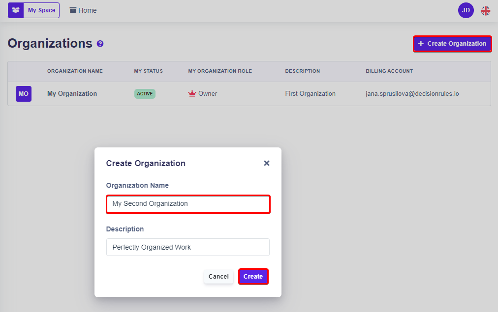

# Organization List

Organizations can be accessed from the Decision Rules side menu through the "Organizations" section. In the organization section you can create a new organization, also here you can find all your organizations and organizations you are a member of.

### Create an organization

Use the "**Create Organization**" button to display a window for entering the name of the new organization (required). By clicking on "Create" button, new organization is created and is accessible from the Organization List.

<figure><figcaption></figcaption></figure>
