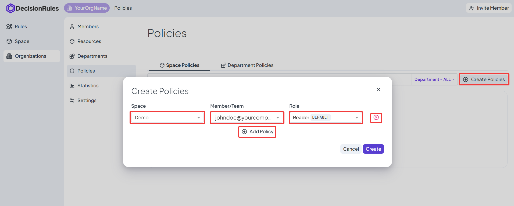
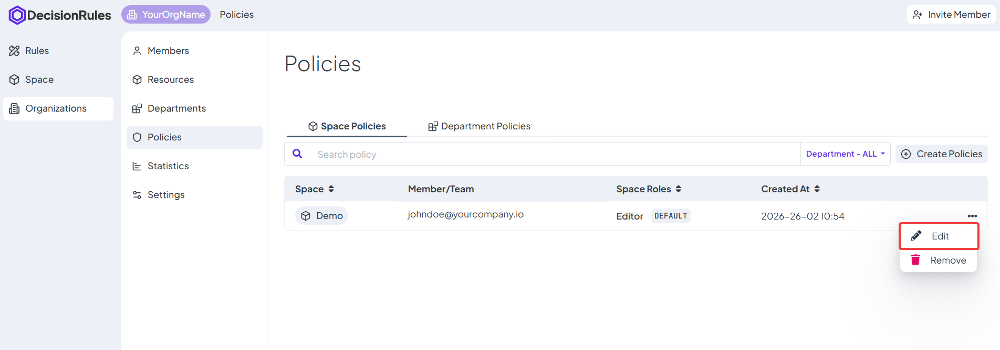
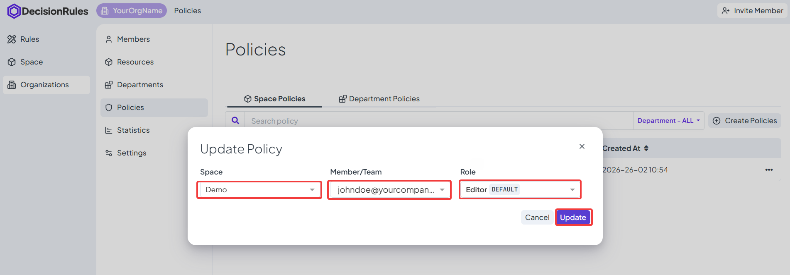
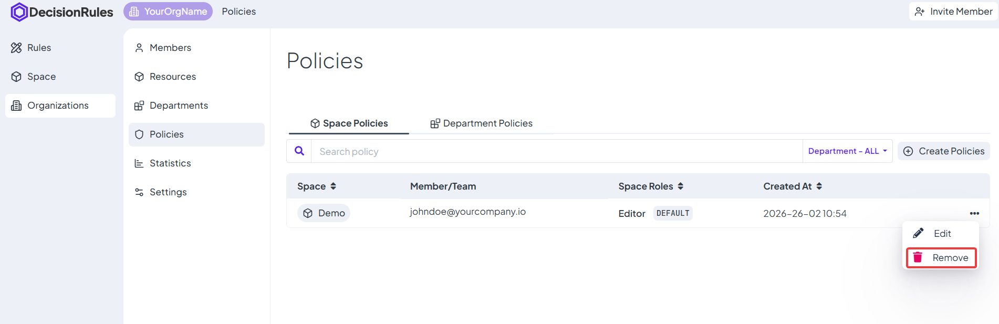

# Policies

Policies are set of rules of managing user permissions within a given space. These rules define who has access to what resources, what actions they can perform, and under what conditions access is granted or restricted. By establishing clear policies, organizations can ensure that user permissions are managed in a consistent, secure, and compliant manner.

## List of polices

You can toggle between two policy views using the tabs at the top of the page:

#### Space Policies

* This section outlines the permissions granted to members, teams, or space roles within the system. The table below provides a comprehensive overview of the permissions assigned to each entity within different spaces.

#### Department Policies

This tab is used exclusively for delegating authority. Here, you appoint Department Managers.

* Scope: Locked to Departments (instead of Spaces).
* Role: Automatically fixed to Manager.

<figure><figcaption>
List of policies
</figcaption></figure>

### **Description of Columns**

The table provides a comprehensive overview of all active permissions. While the specific columns adjust slightly based on the selected tab, the structure remains consistent:

* **Scope** (Space / Department): The name of the specific resource the policy applies to.
* **Entity** (Member / Team): The individual or group receiving access.
* **Role**: The level of access granted (e.g., "Viewer," "Editor," or "Manager").
* **Created At**: The timestamp of when the policy was established.
* **Actions**: Options to Edit or Remove the policy.

## Crete new policies

The workflow for creating policies is unified across both tabs, with one key logic difference.

1. Click Create: Select the "Create Policies" button in the top right.
2. Select Entity: Choose the User or Team you wish to assign.
3. Select Scope: Choose the Space (or Department) where this policy applies.
4. Select Role:
   * _If in Space Policies:_ Select the desired permission level (e.g., Viewer, Editor).
   * _If in Department Policies:_ This is auto-locked to Manager.
5. Confirm: Click Create to save.


#### Batch Creation

You can assign multiple policies at once by using the "Add Policy" button within the dialog before clicking the final confirmation.


<figure><figcaption>
Create new policy
</figcaption></figure>

## Update policy

Each policy can be modified. By selecting the “Edit” option from the action menu on the right. The change is confirmed with the "Update" button.

<figure><figcaption>
Open policy editation
</figcaption></figure>

<figure><figcaption>
Edit policy and save
</figcaption></figure>

## Delete policy

Individual Policies can be deleted by selecting the “Remove” option from the action menu. The deletion is confirmed by pressing the "Remove" button. By deleting the Policy, it is removed from the table and the rights it provided are no longer valid.


Deleting a policy immediately revokes access. The affected Member or Team will lose visibility of that Space or Department instantly.


<figure><figcaption>
Delete a policy
</figcaption></figure>
